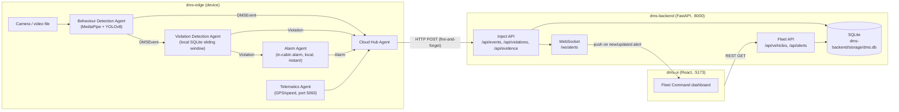
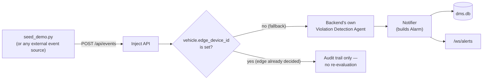
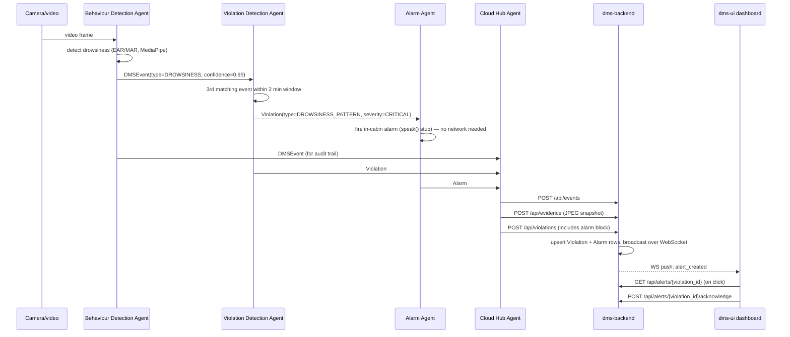

# Driver Monitor POC — Developer & Demo Guide

This is the one-stop document for getting the whole system running on your laptop:
what each piece does, how they talk to each other, where the data lives, and how
to see it all working end-to-end. It's written for someone who has just cloned the
repo and knows nothing else about it.

If you just want to run it right now, jump to **[Quick Start](#quick-start)**.

**Credit**: `dms-edge`'s core detection logic and AI models (MediaPipe face-mesh drowsiness/yawn
detection, YOLOv8 phone-usage detection) are from
[raviR-lab/DriverMonitorPOC](https://github.com/raviR-lab/DriverMonitorPOC), vendored unmodified
under `specs/DriverMonitorPOC-main/`. This repo's `dms-edge` is an **agentification** of that
project: it wraps the same detection core in a `BaseAgent` pipeline and adds a local, on-device
violation-detection model (SQLite sliding-window rule engine) so violations are decided on the
vehicle itself rather than just reporting raw behaviour events.

---

## Table of contents

1. [What you're running](#what-youre-running)
2. [Quick Start (one-click demo)](#quick-start)
3. [Prerequisites](#prerequisites)
4. [The components, one by one](#the-components-one-by-one)
   - [dms-backend](#dms-backend)
   - [dms-ui](#dms-ui)
   - [dms-edge](#dms-edge)
   - [fleet-simulator (not built yet)](#fleet-simulator-not-built-yet)
5. [Request flow diagrams](#request-flow-diagrams)
6. [Edge → backend integration: sample JSON payloads](#edge--backend-integration-sample-json-payloads)
7. [Image/video evidence: where it goes and how it flows](#imagevideo-evidence-where-it-goes-and-how-it-flows)
8. [Database: schema and file locations](#database-schema-and-file-locations)
9. [Configuration reference](#configuration-reference)
10. [Troubleshooting](#troubleshooting)

---

## What you're running

This POC is a driver-monitoring dashboard. A camera-based detector watches a driver
for drowsiness, phone use, and distraction; when a pattern crosses a threshold it's
graded into a "violation" and shown on a live fleet dashboard.

There are three components that actually exist and run today:

| Component | What it is | Tech |
|---|---|---|
| `dms-backend` | The server: stores everything, serves the dashboard's data and live updates | Python 3.11, FastAPI, SQLite |
| `dms-ui` | The dashboard you look at in a browser | React 19, Vite |
| `dms-edge` | The camera-based detector — watches video, decides violations locally, sends results to the backend | Python 3.11, OpenCV, MediaPipe, YOLOv8 |

There is a fourth planned component, **`fleet-simulator`**, that does **not exist on
disk yet** — see [that section](#fleet-simulator-not-built-yet) for what stands in
for it today.

**The key idea of this POC**: `dms-edge` does the smart part *locally* — it decides
"this is a violation" on-device and can sound an in-cabin alarm without waiting on
the network. `dms-backend` is where results land for the fleet-wide dashboard, and
it only does its own (simpler, fallback) detection for vehicles that have no edge
device at all.

You don't need `dms-edge` running to see the dashboard work — a seed script can
inject the same kind of data directly into the backend so you can demo the UI
without a camera. See [Quick Start](#quick-start).

---

## Quick Start

### Option A — One click (recommended for a first look)

From the repo root:

**Windows (PowerShell):**
```powershell
.\demo\scripts\start_demo.ps1
```

**macOS/Linux (bash):**
```bash
./demo/scripts/start_demo.sh
```

This script will, in order:
1. Check that Python 3.11+ and Node 18+ are installed.
2. Create/reuse a virtual environment for `dms-backend` and install its dependencies.
3. Start the backend (FastAPI) in the background on **http://localhost:8000**.
4. Install `dms-ui`'s npm dependencies (first run only) and start it in the background on **http://localhost:5173**.
5. Wait for the backend to respond, then run `dms-backend/scripts/seed_demo.py` to inject a realistic batch of sample violations (drowsiness, phone use, distraction, continuous drive).
6. Print the dashboard URL and tell you how to stop everything.

Open **http://localhost:5173** — you should see live alerts on the Overview page.
`dms-edge` is **not** started by this script (it needs a real or sample video file
and a camera-capable machine) — see [Option B](#option-b--include-the-edge-detector)
if you want the full camera pipeline instead of seeded data.

To stop everything the script started:
```powershell
.\demo\stop_demo.ps1      # Windows
./demo/stop_demo.sh       # macOS/Linux
```

### Option B — Include the edge detector

If you have a sample driving video (e.g. `dms-edge/videos/dataset.mp4` — you must
supply this yourself, see [dms-edge](#dms-edge)), run the backend and UI as above,
then in a third terminal:

```powershell
cd dms-edge
py -3.11 -m venv .venv
.\.venv\Scripts\pip.exe install -r requirements.txt
.\.venv\Scripts\python.exe main.py --video videos\dataset.mp4 --no-display
```

This runs real computer-vision detection against the video file and pushes real
events/violations to the backend over HTTP, exactly like a physical edge device
would. Don't also run `seed_demo.py` at the same time unless you want both real and
synthetic data mixed together on the dashboard.

### Option C — Docker (backend + UI only, no camera pipeline)

```bash
docker compose up --build
```
Backend on `:8000`, UI on `:5173`. `dms-edge` is not containerized and is not part
of `docker-compose.yml`. To seed sample data into the dockerized backend:
```bash
docker compose exec backend python scripts/seed_demo.py
```

---

## Prerequisites

Install these before running anything manually (the one-click scripts check for
Python and Node, but won't install them for you):

- **Python 3.11 or newer** — both `dms-backend` and `dms-edge` require it.
  Windows: install from python.org and make sure the `py` launcher is available
  (`py -3.11 --version` should print `Python 3.11.x`).
- **Node.js 18 or newer** (Node 20+ recommended — that's what the Docker image
  uses) — for `dms-ui`. Check with `node --version`.
- **A webcam or a sample driving video file** — only needed if you want to run
  `dms-edge` for real; not needed for the seeded-data demo.

Optional, not required by any of the run paths below:
- **Docker Desktop** — only if you want the containerized backend+UI path.
- **`uv`** (the Python package manager) — only called out as a workaround for a
  known `libexpat` issue installing `mediapipe` on some macOS/Homebrew Python
  setups. Skip this unless you hit that specific error.

---

## The components, one by one

### dms-backend

**What it does**: a FastAPI server that stores vehicles, drivers, events,
violations, alarms, and evidence files in a local SQLite database, and serves that
data to the dashboard over REST + a WebSocket. It also has its own (simpler) rule
engine that runs *only* for vehicles that have no edge device attached — normally
`dms-edge` does this job and just hands the backend a finished result.

**Install & run manually:**

```powershell
cd dms-backend
py -3.11 -m venv .venv
.\.venv\Scripts\pip.exe install -r requirements.txt
.\.venv\Scripts\python.exe -m uvicorn app.main:app --reload --host 0.0.0.0 --port 8000
```

macOS/Linux:
```bash
cd dms-backend
python3 -m venv .venv
source .venv/bin/activate
pip install -r requirements.txt
./scripts/start_backend.sh
```

Once running: API docs (interactive, try requests from the browser) at
**http://localhost:8000/docs**.

**Populate it with sample data** (no camera or dms-edge needed):
```powershell
.\.venv\Scripts\python.exe scripts\seed_demo.py
```
This posts a scripted batch of events straight to the backend's own `/api/events`
endpoint — the same door `dms-edge` would knock on — covering all four violation
types plus a couple of events that deliberately *don't* cross a threshold (so you
can see the difference on the dashboard).

**Where its files live:**
- Code: `dms-backend/app/`
- Config (ports, thresholds, paths): `dms-backend/app/config.py` — plain Python
  constants, edit the file directly to change something (there are no environment
  variables for the backend today).
- Database file: `dms-backend/storage/dms.db` (created automatically on first run)
- Evidence images/videos: `dms-backend/storage/evidence/images/` and `.../videos/`

### dms-ui

**What it does**: the React dashboard — "Fleet Command". Shows a live list of
alerts, lets you click into one to see trip/evidence/location/vehicle details, and
lets you acknowledge an alert or send an advisory message back (which updates the
backend and broadcasts to any other open dashboard over the WebSocket).

**Install & run:**
```bash
cd dms-ui
npm install
npm run dev
```
Opens at **http://localhost:5173**.

**Which backend it talks to**: set in `dms-ui/.env`:
```
VITE_API_BASE_URL=http://localhost:8000
```
Change this if your backend runs on a different host/port. The WebSocket URL is
derived automatically from this same value (`http://` → `ws://`, same host/port,
path `/ws/alerts`) — you don't set it separately.

### dms-edge

**What it does**: the camera-based detector. Wraps an existing computer-vision app
(MediaPipe face mesh for drowsiness/yawn detection, YOLOv8 for phone-in-hand
detection) and adds the "agentic" layer on top: it watches a video feed, decides
locally when a pattern of events becomes a violation (using its own local SQLite
database — no network round-trip needed to make that call), fires a simulated
in-cabin alarm, and then also pushes the finished event/violation/evidence to
`dms-backend` so it shows up on the fleet dashboard.

The computer-vision core (MediaPipe/YOLOv8 detection) is not original to this repo —
it's vendored unmodified from [raviR-lab/DriverMonitorPOC](https://github.com/raviR-lab/DriverMonitorPOC)
(see `specs/DriverMonitorPOC-main/`). What `dms-edge` adds on top is the
agentification: the `BaseAgent` pipeline described above, plus the local violation-detection
model (the SQLite sliding-window rule engine) that turns that project's raw behaviour
events into on-vehicle violation decisions.

**Install & run:**
```powershell
cd dms-edge
py -3.11 -m venv .venv
.\.venv\Scripts\pip.exe install -r requirements.txt
.\.venv\Scripts\python.exe main.py --video videos\dataset.mp4 --no-display
```

You need to supply your own video file — none ships with the repo. Any front-facing
driver video works for a demo; put it at `dms-edge/videos/dataset.mp4` (or pass a
different path to `--video`).

Useful flags:
| Flag | What it does |
|---|---|
| `--video <path>` | Run against a video file (this is how the demo works today — there's no live-camera mode yet) |
| `--no-display` | Don't pop up a video preview window |
| `--no-ui` | Don't start the local status web page (otherwise at `http://localhost:5050`) |
| `--no-cloud` | Don't push anything to `dms-backend` — fully offline/local-only run |
| `--save` | Save an annotated copy of the video to `dms-edge/output/` |
| `--vehicle-config <path.json>` | Tag this run with a specific truck/driver identity (and optionally a GPS route) — see below |

**Which backend it talks to**: environment variable `BACKEND_URL`, defaults to
`http://localhost:8000`. Set it before launching if your backend lives elsewhere:
```powershell
$env:BACKEND_URL = "http://192.168.1.50:8000"
.\.venv\Scripts\python.exe main.py --video videos\dataset.mp4 --no-display
```

**Simulating GPS/telemetry**: by default `dms-edge` generates its own plausible GPS/speed/RPM
telemetry in-process (the **Telematics Simulator**) — you don't need to run or feed anything
separately; it starts automatically alongside every other agent when you run `main.py`. Since
`fleet-simulator` doesn't exist yet, this simulator is what stands in for it. Two modes, controlled
by whether `--vehicle-config` supplies a `route`:

- **No `--vehicle-config`, or a config with no `route` block** — the simulator loops a small canned
  set of waypoints with an oscillating speed, so you'll see *some* motion with zero setup.
- **`--vehicle-config` with a `route` block** — GPS position is derived from the reported speed (not
  generated separately), so the truck visibly and consistently moves from a `from` coordinate toward
  a `to` coordinate over a duration you choose. This is the "GPS and speed move together" behavior.

**`--vehicle-config <path.json>`** tags the run with a specific truck/driver identity, so events and
violations pushed to `dms-backend` show a real vehicle registration/VIN/fleet ID and driver name/ID
instead of the generic `EDGE_VEHICLE_REGISTRATION` default with no driver attached. It also feeds the
dashboard's **Trip Details** card (driver, route, shift, speed at event, trip started) — see
[below](#trip-details-driver-route-shift). Required fields: `vehicle_registration`, `vin`, `fleet_id`,
`driver_name`, `driver_id`. Any other top-level keys (e.g. `depot`, `notes`) are forwarded to
`dms-backend` as opaque metadata — add whatever you want. A sample file ships at
`dms-edge/fleet/example-vehicle-config.json`:

```json
{
  "vehicle_registration": "MH-12-AB-4321",
  "vin": "1HGCM82633A004352",
  "fleet_id": "FLEET-WEST-07",
  "driver_name": "Ramesh Kulkarni",
  "driver_id": "DRV-10245",
  "route_name": "Mumbai-Pune Corridor",
  "shift_label": "Day Shift (06:00-14:00)",
  "depot": "Pune Hub 3",
  "insurance_expiry": "2027-01-15",
  "notes": "Demo truck for AI COE showcase",
  "route": {
    "from_lat": 18.5204,
    "from_lon": 73.8567,
    "to_lat": 18.5384,
    "to_lon": 73.8757,
    "avg_speed_kmh": 60,
    "duration_secs": 180
  }
}
```

The optional `route` block is what drives the GPS/speed tandem above — `from_lat`/`from_lon` and
`to_lat`/`to_lon` are the start/end coordinates, `avg_speed_kmh` is the average speed to pace the
trip at, and `duration_secs` is how long (in seconds) the simulated truck should take to complete
it — match this to roughly how long your `--video` file runs so the truck "arrives" around when the
demo ends. Once `duration_secs` elapses the truck holds at the destination coordinate and reports
`speed_kmh: 0`. Omit `route` entirely to fall back to the canned-waypoint behavior. All 5 required
top-level fields must be present if the file is supplied at all — a missing one makes `main.py` exit
immediately with the field name, before it even opens the video, so mistakes are obvious rather than
silent. `route_name`, `shift_label`, and `route` are all optional and independent of each other —
`route_name` is just a display string for the Trip Details card, unrelated to the `route` block's GPS
coordinates.

#### Trip Details (driver, route, shift, speed, trip started)

The dashboard's alert detail panel has a **Trip Details** card (driver, route, shift, speed at
event, trip started/elapsed). It's populated end-to-end from `--vehicle-config`:

- `driver_name`/`driver_id` → straight from the config, as described above.
- `route`/`shift_label` → from the config's optional `route_name`/`shift_label` fields (shown as-is,
  no derivation). Omit them and the card shows "—" for just those two fields — nothing else breaks.
- `trip_id`/`trip_started_at`/`elapsed_trip_seconds` → generated once when `dms-edge`'s Cloud Hub
  Agent starts (one trip per process run — there's no ignition-cycle/trip-boundary detection in this
  POC, so restarting `main.py` starts a new trip).
- `speed_at_event_kmh` → the vehicle speed (from the Telematics Simulator/Agent) at the moment the
  event that anchors the violation's evidence was recorded.

Without `--vehicle-config` at all, every one of these fields shows "—"/"Unknown driver" — same as
before this was wired up — since there's no driver/route/shift identity to attach.

```powershell
.\.venv\Scripts\python.exe main.py --video videos\dataset.mp4 --no-display `
  --vehicle-config fleet\example-vehicle-config.json
```

**Manually feeding telemetry** is still possible (e.g. to test one specific GPS point, or if you set
`TELEMATICS_SOURCE=http` to disable the built-in simulator and drive telemetry externally instead):
```powershell
Invoke-RestMethod -Method Post -Uri http://localhost:5060/telemetry `
  -ContentType "application/json" `
  -Body '{"truckId":"EDGE-DEMO-001","latitude":34.05,"longitude":-118.25,"speed":72,"heading":180,"status":"MOVING","rpm":1500}'
```
`truckId` needs to match `EDGE_VEHICLE_REGISTRATION` (or your `--vehicle-config`'s
`vehicle_registration`) for the reading to attach to the right vehicle.

**Where its files live:**
- Code: `dms-edge/main.py` (entry point) + `dms-edge/agents/` (the 5 agents) +
  `dms-edge/src/` (vendored detection app + config)
- Local database: `dms-edge/storage/local.db` (its own sliding-window violation
  history — separate from the backend's database)

### fleet-simulator (not built yet)

The intended design is a standalone tool that simulates one or more trucks driving
along GPS routes and feeds that telemetry to `dms-edge` (or directly to
`dms-backend`, for vehicles with no edge device). **It doesn't exist as code yet.**

Until it's built, two things stand in for it:
- `dms-backend/scripts/seed_demo.py` — injects realistic sample violations directly
  into the backend, for demoing the dashboard with zero camera/edge setup.
- Manually POSTing to `dms-edge`'s `/telemetry` endpoint (shown above), for
  demoing GPS-aware alerts alongside a real video-driven edge run.

---

## Request flow diagrams

### End-to-end system (edge-primary path)



### Fallback path (no edge device on a vehicle)



### A single alert, start to finish



---

## Edge → backend integration: sample JSON payloads

`dms-edge`'s **Cloud Hub Agent** (`dms-edge/agents/cloud_hub_agent.py`) is the only
thing that talks to `dms-backend` over HTTP. It's fire-and-forget: if the backend
is unreachable, it logs and drops the request (0.5s timeout, no retry) — this
matters because the edge's own alarm already fired locally, so a dropped network
call never blocks or delays the in-cabin warning.

### 1. `POST /api/events` — raw detection (always sent, mainly an audit trail)

```json
{
  "event_id": "3f9a1c2d",
  "timestamp": 1234567890.123,
  "source": "dms-edge",
  "detection": {
    "type": "DROWSINESS",
    "confidence": 0.95,
    "metrics": { "ear": 0.18, "blink_rate": 22 }
  },
  "context": {
    "vehicle_registration": "EDGE-DEMO-001",
    "frame_index": 142,
    "camera_id": "cam-0",
    "lat": 34.05,
    "lon": -118.25
  },
  "vehicle": { "speed_kmh": 72.0, "is_moving": true },
  "device": { "device_id": "edge-001", "device_model": "renesas_rcar" }
}
```

Only these event types are ever forwarded: `DROWSINESS`, `YAWN`, `DISTRACTION`,
`PHONE_USAGE`, `NO_FACE`, `CONTINUOUS_DRIVE`. Purely in-cabin event types
(`DRIVER_QUESTION`, `DRIVER_ANSWER`, `SYSTEM`) are never sent to the backend.

### 2. `POST /api/evidence` — snapshot for the alert (drowsiness & phone-use only)

Sent as `multipart/form-data`, not JSON:

| Field | Value |
|---|---|
| `event_id` | `3f9a1c2d` (matches the event above) |
| `file` | JPEG bytes of the current camera frame |

The backend saves it as `dms-backend/storage/evidence/images/3f9a1c2d.jpg` and
links it to the event so the dashboard's evidence panel can show it.

### 3. `POST /api/violations` — the graded, ready-to-display alert

```json
{
  "violation_id": "viol_a1b2c3d4e5f6",
  "violation_type": "DROWSINESS_PATTERN",
  "severity": "CRITICAL",
  "status": "ACTIVE",
  "event_count": 3,
  "trigger_event_ids": ["ev1", "ev2", "3f9a1c2d"],
  "first_event_timestamp": 1234567890.0,
  "last_event_timestamp": 1234568010.0,
  "recommended_action_text": "3rd micro-sleep in 2.0 min. Advise driver to pull over safely.",
  "context": {
    "vehicle_registration": "MH-12-AB-4321",
    "driver_id": "DRV-10245",
    "driver_name": "Ramesh Kulkarni",
    "route": "Mumbai-Pune Corridor",
    "shift_label": "Day Shift (06:00-14:00)",
    "trip_id": "trip_a1b2c3d4e5f6",
    "trip_started_at": 1234567000.0,
    "elapsed_trip_seconds": 890.12,
    "lat": 34.05, "lon": -118.25
  },
  "vehicle": { "speed_kmh": 72.0, "is_moving": true },
  "alarm": {
    "fired_at": 1234568010.0,
    "message": "DROWSINESS DETECTED. PULL OVER SAFELY.",
    "driver_ack_latency_seconds": 7.4,
    "speed_before_kmh": 72.0,
    "speed_after_kmh": 43.9
  }
}
```

This is what actually creates the card you see on the dashboard's Live Alerts list.
The backend upserts one `Violation` row (and its linked `Alarm` row) keyed by
`violation_id`, then broadcasts an `alert_created` (or `alert_updated`, if the
violation already existed and just grew — e.g. a 4th drowsiness event) message to
every dashboard connected over `/ws/alerts`.

`context.driver_id`/`driver_name` resolve the `Violation`'s linked `Driver` row (so the alert
detail panel's Trip Details card shows a real name instead of "Unknown driver"); `route`/
`shift_label`/`trip_id`/`trip_started_at`/`elapsed_trip_seconds` are carried straight through.
`speed_at_event_kmh` in the Trip Details card comes from the matching `Event` row (looked up via
`trigger_event_ids`) rather than from this payload directly — so a violation whose trigger events
were never separately `POST`ed to `/api/events` will show "—" for that one field even though
driver/route/shift/trip-started all resolve correctly. `dms-edge`'s Cloud Hub Agent always sends
both `/api/events` and `/api/violations` for a real drowsiness/distraction/phone-usage detection,
so this only matters if you're hand-crafting a `/api/violations` call for testing.

---

## Image/video evidence: where it goes and how it flows

1. `dms-edge`'s Behaviour Detection Agent captures a frame at the moment a
   drowsiness or phone-usage event fires.
2. The Cloud Hub Agent JPEG-encodes that frame and `POST`s it as
   `multipart/form-data` to `dms-backend`'s `/api/evidence` endpoint, alongside the
   `event_id` it belongs to.
3. The backend looks at the file extension to decide image vs. video
   (`mp4`/`mov`/`avi` → video folder, anything else → image folder), and saves the
   file as **`{event_id}.{extension}`**:
   - Images → `dms-backend/storage/evidence/images/`
   - Videos → `dms-backend/storage/evidence/videos/`
4. An `Evidence` row is created (or updated) in the database, linking that file
   path back to the original `Event` row.
5. The dashboard fetches it via `GET /api/evidence/{filename}`, which the backend
   serves straight off disk.

If you're demoing without `dms-edge` (using `seed_demo.py` instead), the same flow
happens with a placeholder image — `dms-backend/scripts/assets/placeholder_evidence.jpg`
— uploaded the same way, so the dashboard's evidence panel still has something to
show.

**Manually placing evidence for testing**: drop any `.jpg` at
`dms-backend/storage/evidence/images/<event_id>.jpg`, matching an existing event's
`event_id`, and it'll be picked up next time that event's evidence is requested —
though normally you'd go through `/api/evidence` rather than placing files by hand.

---

## Database: schema and file locations

Both `dms-backend` and `dms-edge` use **SQLAlchemy over SQLite** — no separate
database server to install, and no migration tool (Alembic etc.) is used; tables
are created automatically on startup if they don't already exist.

### dms-backend — `dms-backend/storage/dms.db`

| Table | Purpose | Key columns |
|---|---|---|
| `vehicles` | One row per truck | `registration` (unique), `vin`, `fleet_id`, `vehicle_type`, `region`, `edge_device_id`, `edge_device_status`, `firmware_version`, `extra_metadata` |
| `drivers` | One row per driver | `driver_id` (unique, fleet-system ID), `name`, `extra_metadata` |
| `events` | Every raw detection received (audit trail) | `event_id` (unique), `timestamp`, `type`, `confidence`, `metrics_json`, `vehicle_id`, `driver_id`, `trip_id`, `speed_kmh`, `rpm`, `lat`/`lon` |
| `evidence` | One row per event with a saved image/video | `event_id` (FK, unique), `image_path`, `video_path`, `sync_status` |
| `violations` | Graded alerts shown on the dashboard | `violation_id` (unique), `violation_type`, `severity`, `status` (`ACTIVE`/`ACKNOWLEDGED`/`RESOLVED`), `event_count`, `trigger_event_ids_json`, `recommended_action_text` |
| `alarms` | The driver-facing alert tied to a violation | `alarm_id` (unique), `violation_id` (FK, unique), `message`, `driver_ack_latency_seconds`, `speed_before_kmh`/`speed_after_kmh`, `status` (`PENDING_ACK`) |

Relationships: `Event` 1:1 `Evidence` · `Vehicle`/`Driver` 1:many `Event` and
`Violation` · `Violation` 1:1 `Alarm`.

Created by: `Base.metadata.create_all()` in `dms-backend/app/db/database.py`,
called automatically when the FastAPI app starts up. Delete
`dms-backend/storage/dms.db` and restart the backend to get a completely clean
database (evidence files under `storage/evidence/` are separate — delete that
folder too for a full reset).

### dms-edge — `dms-edge/storage/local.db`

A much smaller, single-vehicle-scoped database — just enough for the Violation
Detection Agent's own sliding-window history on that one device. Separate from,
and not synced with, the backend's database (the backend gets its copy of the
finished violation via the `/api/violations` push described above).

---

## Configuration reference

Nothing in this stack needs a secrets manager or cloud config — everything is a
plain constant or a locally-set environment variable.

### dms-backend — `dms-backend/app/config.py` (edit the file directly; no env vars)

| Setting | Default |
|---|---|
| Host / port | `0.0.0.0` / `8000` |
| Database file | `dms-backend/storage/dms.db` |
| Evidence folders | `dms-backend/storage/evidence/{images,videos}/` |
| CORS origins | `["*"]` (wide open — fine for a local demo) |
| Drowsiness rule | 3 events in 120s → CRITICAL |
| Phone usage rule | confidence > 0.85 → HIGH |
| Distraction rule | 2 events in 60s → MEDIUM |
| Continuous drive rule | > 4 hours → LOW |

### dms-edge — `dms-edge/src/config.py` (environment variables, all with defaults)

| Variable | Default | Meaning |
|---|---|---|
| `EDGE_VEHICLE_REGISTRATION` | `EDGE-DEMO-001` | Which vehicle this device represents (overridden by `--vehicle-config` when given) |
| `BACKEND_URL` | `http://localhost:8000` | Where the Cloud Hub Agent sends events/violations/evidence |
| `TELEMATICS_INGEST_PORT` | `5060` | Port the Telematics Agent listens on for `POST /telemetry` |
| `DEVICE_ID` | `edge-001` | Identifies this physical/simulated device |
| `TELEMATICS_SOURCE` | `simulator` | `"simulator"` runs the in-process Telematics Simulator; `"http"` expects a real Fleet Simulator POSTing to `/telemetry` |

### dms-ui — `dms-ui/.env`

| Variable | Default |
|---|---|
| `VITE_API_BASE_URL` | `http://localhost:8000` |

The WebSocket URL is derived from this automatically — don't set it separately.
Note this is a Vite build-time variable: if you change it, restart `npm run dev`
(or rebuild, for the Docker image) for it to take effect.

---

## Troubleshooting

**"Port already in use" (8000 or 5173)**

Windows:
```powershell
Get-NetTCPConnection -LocalPort 8000 | Select-Object -ExpandProperty OwningProcess | ForEach-Object { Stop-Process -Id $_ -Force }
```
macOS/Linux:
```bash
lsof -ti:8000 | xargs kill -9
```

**Dashboard loads but shows no alerts**

- Confirm the backend is actually running and reachable: open
  `http://localhost:8000/docs` directly in a browser.
  Have you run `seed_demo.py` or started `dms-edge`? An empty database is a valid,
  quiet state — nothing has told the backend about a violation yet.
- Open your browser's dev tools → Network tab → check the WebSocket connection to
  `/ws/alerts` isn't failing (a red/closed connection usually means
  `VITE_API_BASE_URL` doesn't point at the backend you actually started).

**`mediapipe` fails to install on macOS (Homebrew Python)**

Known `libexpat` linking issue unrelated to this project. Workaround: install via
`uv` instead of plain `pip` (see `dms-backend/README.md` and `dms-edge/README.md`
for the exact command) — `uv` bundles its own Python build that doesn't hit this.

**PowerShell says script execution is disabled**

Run once per session:
```powershell
Set-ExecutionPolicy -Scope Process -ExecutionPolicy Bypass
```
then re-run the `.ps1` script.

**Want a completely clean slate**

Stop everything, then delete:
- `dms-backend/storage/dms.db`
- `dms-backend/storage/evidence/`
- `dms-edge/storage/local.db` (if you ran the edge)

All three are recreated automatically the next time their owning component starts.
