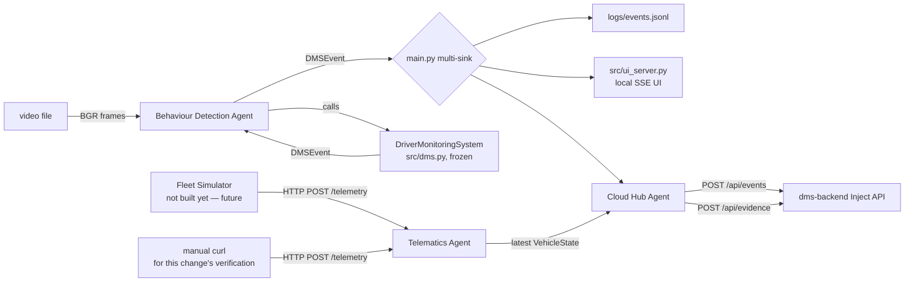

# Design — add-dms-edge

## Approach

Follow `.claude/skills/dms-edge-dev/SKILL.md` and `.claude/skills/dms-agentic-architecture/SKILL.md`
directly. Vendor `specs/DriverMonitorPOC-main` into `dms-edge/src/` **unmodified** (it's frozen
reference CV code — MediaPipe Face Mesh + YOLOv8n phone detection, time-based event windows), and add
exactly three new agents on top, each implementing the shared `BaseAgent[TIn, TOut]` Protocol
(`name: str`, `run(input_) -> output`, no hidden global state, no shared library — duplicated
per-component per the doctrine):

- **`TelematicsAgent`** (`agents/telematics_agent.py`) — `BaseAgent[TelemetryUpdate, VehicleState]`.
  Runs its own tiny Flask listener (`POST /telemetry` on `TELEMATICS_INGEST_PORT`, default `5060`) —
  not bolted onto the frozen `src/ui_server.py`. Lock-protected latest-state store, no history.
- **`BehaviourDetectionAgent`** (`agents/behaviour_detection_agent.py`) — `BaseAgent[Frame, list[DMSEvent]]`.
  Thin wrapper: holds a `DriverMonitoringSystem` instance, `run(frame)` calls `process_frame()`,
  returns whatever `DMSEvent`s fired during that call. Zero detection logic of its own.
  Implements `EventSink` (has an `emit(event)` method) so it can also be passed directly into
  `DriverMonitoringSystem(sink=...)` and used from `main.py`'s multi-sink fan-out.
- **`CloudHubAgent`** (`agents/cloud_hub_agent.py`) — `BaseAgent[DMSEvent, None]`, fire-and-forget.
  Reads `TelematicsAgent`'s latest `VehicleState`, maps `DMSEvent` → `dms-backend`'s nested `EventIn`
  JSON, `POST /api/events` (~0.5s timeout), then `POST /api/evidence` (multipart) for
  `PHONE_USAGE`/`DROWSINESS` events, using the latest annotated frame as the evidence JPG. Logs and
  drops on any failure — no retry queue.

`main.py` is adapted minimally: instantiate `TelematicsAgent` (start its Flask listener in a daemon
thread), `BehaviourDetectionAgent`, `CloudHubAgent`; add `CloudHubAgent` as a fourth sink alongside
the existing file/SSE sinks in the existing `_Multi.emit()` fan-out. `src/dms.py`, `src/events.py`,
`src/alert_templates.py`, `src/ui_server.py` are byte-for-byte copies — not touched.

## Architecture / flow



## Files touched

New:
- `dms-edge/main.py` — adapted from `specs/DriverMonitorPOC-main/main.py` (instantiate + wire the
  three agents into the existing sink fan-out; argument parsing otherwise unchanged)
- `dms-edge/src/{__init__.py,config.py,events.py,alert_templates.py,dms.py,ui_server.py}` — vendored
  from `specs/DriverMonitorPOC-main/src/`; only `config.py` gets new values appended (see below),
  the rest byte-for-byte
- `dms-edge/models/` — vendored from `specs/DriverMonitorPOC-main/models/`
- `dms-edge/scripts/{run_demo.sh,bench_yolo.py,extract_frames.py,report.py}` — vendored, unchanged
- `dms-edge/DEPLOY.md` — vendored, unchanged
- `dms-edge/agents/{__init__.py,base.py,telematics_agent.py,behaviour_detection_agent.py,cloud_hub_agent.py}` — new
- `dms-edge/requirements.txt` — vendored + `requests` added
- `dms-edge/README.md` — new, run instructions (mirrors `dms-backend/README.md`'s style)
- `dms-edge/tests/test_agents.py` — new, unit tests for the mapping/state logic (no camera/YOLO
  dependency — mock `DriverMonitoringSystem`)

Modified:
- root `.gitignore` — add `dms-edge/.venv/`, `dms-edge/__pycache__/`, `dms-edge/logs/`,
  `dms-edge/output/dms_out_*.mp4`, `dms-edge/data/calib/`, `dms-edge/videos/*.mp4`

Not touched (explicitly out of scope): `dms-backend`, `dms-ui`, Docker/`docker-compose.yml`,
`fleet-simulator` (doesn't exist yet).

## Data / API contract changes

No changes to `dms-backend`'s existing `EventIn`/`DetectionIn`/`ContextIn`/`VehicleIn`/`DeviceIn`
schemas (`dms-backend/app/schemas.py`) — `CloudHubAgent` maps into them as documented in
`dms-edge-dev` skill's "Data flow contract" table. New shapes, local to `dms-edge/agents/`:

```python
@dataclass
class TelemetryUpdate:   # input to TelematicsAgent.run(), matches fleet-simulator-dev's GPS schema
    truck_id: str
    timestamp: str
    latitude: float
    longitude: float
    speed: float
    heading: float
    status: str  # "MOVING" | "STOPPED" | "IDLE"

@dataclass
class VehicleState:      # output of TelematicsAgent.run(), read by CloudHubAgent
    lat: float | None
    lon: float | None
    speed_kmh: float | None
    heading: float | None
    is_moving: bool
    last_updated: float  # time.time()
```

`Frame` (Behaviour Detection Agent's input) is just a `numpy.ndarray` (BGR), matching what
`DriverMonitoringSystem.process_frame()` already takes — no new type needed.

Event-type mapping (forward, drop, or pass-through) follows the skill's table exactly: forward
`DROWSINESS`/`PHONE_USAGE`/`DISTRACTION`/`CONTINUOUS_DRIVE`/`YAWN`/`NO_FACE`; drop
`DRIVER_QUESTION`/`DRIVER_ANSWER`/`SYSTEM` (not sent to `/api/events` at all).

`src/config.py` additions (appended, nothing existing removed/changed):
```python
EDGE_VEHICLE_REGISTRATION = os.environ.get("EDGE_VEHICLE_REGISTRATION", "EDGE-DEMO-001")
BACKEND_URL = os.environ.get("BACKEND_URL", "http://localhost:8000")
BACKEND_REQUEST_TIMEOUT_SECS = 0.5
TELEMATICS_INGEST_HOST = "0.0.0.0"
TELEMATICS_INGEST_PORT = int(os.environ.get("TELEMATICS_INGEST_PORT", "5060"))
DEVICE_ID = os.environ.get("DEVICE_ID", "edge-001")
DEVICE_MODEL = "renesas_rcar"
CAMERA_ID = "cam-0"
```

## Alternatives considered

Covered in explore.md (Docker now vs. later — decided later/not-this-change).

## Risks / open questions

- No demo video ships in this repo; end-to-end camera-driven verification needs a user-supplied
  `--video` file. Agent-level verification (Telematics ingest, Cloud Hub → backend push) is done via
  manual `curl` + a synthetic `DMSEvent`, independent of having real video.
- `mediapipe==0.10.14` pin (per skill) — legacy `solutions.face_mesh` API; must confirm this installs
  cleanly on the dev machine's Python version during Apply, same caveat `dms-backend/README.md`
  already documents for its own venv setup (Homebrew Python `pyexpat` issue) — use `uv` as a fallback
  if `pip`/`venv` breaks.
- `ultralytics`/`opencv-python`/`mediapipe` are heavy native deps; first `pip install` may take a
  while and needs system libs (`ffmpeg`, `libgl1` equivalents) — acceptable for a POC venv, called
  out in README.
