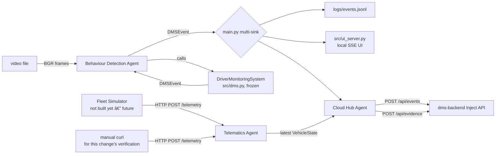

# Release — Add dms-edge (edge/device component)

_Generated by `dms-spec/scripts/generate_release.py` — this is a scaffold, not final copy. Polish the Implementation Summary prose by hand; the run commands are pulled live from each component's README and shouldn't need hand-editing. Last generated 2026-08-03 15:18._

**Change:** `add-dms-edge` · **Tasks:** 15/15 complete

## Implementation Summary

**1. Vendor reference app**
- 1.1 Copy `specs/DriverMonitorPOC-main/{main.py,src,models,scripts,requirements.txt,DEPLOY.md}` into `dms-edge/`
- 1.2 Create `dms-edge/{agents,videos,tests}/`, `agents/__init__.py`

**2. Config**
- 2.1 Append `EDGE_VEHICLE_REGISTRATION`, `BACKEND_URL`, `BACKEND_REQUEST_TIMEOUT_SECS`, `TELEMATICS_INGEST_HOST/PORT`, `DEVICE_ID`, `DEVICE_MODEL`, `CAMERA_ID` to `dms-edge/src/config.py`

**3. Agents**
- 3.1 `agents/base.py` — `BaseAgent` Protocol (per dms-agentic-architecture)
- 3.2 `agents/telematics_agent.py` — `TelematicsUpdate`/`VehicleState` dataclasses, Flask `POST /telemetry` listener, lock-protected latest-state store
- 3.3 `agents/behaviour_detection_agent.py` — thin `DriverMonitoringSystem` wrapper, also usable as an `EventSink`
- 3.4 `agents/cloud_hub_agent.py` — `DMSEvent` + `VehicleState` → backend `EventIn` mapping, `POST /api/events` + `/api/evidence`, drop-on-failure

**4. Wiring**
- 4.1 Adapt `dms-edge/main.py`: instantiate the three agents, start Telematics Agent's listener thread, add `CloudHubAgent` to the existing multi-sink fan-out
- 4.2 `requirements.txt` — add `requests`, `onnxruntime` (the latter was missing from the original vendored app too — the ONNX weights in `models/` need it, discovered during verification)

**5. Docs / hygiene**
- 5.1 `dms-edge/README.md` — run instructions, API surface, config table
- 5.2 Root `.gitignore` — add `dms-edge` entries per skill

**6. Verification**
- 6.1 `python main.py --video <sample> --no-display --no-ui` runs end-to-end without error against a synthetic 40-frame test video (no demo video ships in this repo) — YOLO (ONNX Runtime) + MediaPipe both load and run, events flow through the full agent chain to a live `dms-backend`
- 6.2 `curl -X POST localhost:5060/telemetry -d '{...}'` while `main.py` was running updated the stored vehicle state, confirmed via `curl GET localhost:5060/telemetry`
- 6.3 `pytest tests/` — 8/8 pass, headless (no camera/YOLO)
- 6.4 Synthetic `DMSEvent`s pushed through `CloudHubAgent` against the live (Dockerized) `dms-backend`: `PHONE_USAGE` produced a real `HIGH` violation visible via `GET /api/alerts?status=active`; a `DROWSINESS` event's evidence JPG landed in the backend's evidence volume via `POST /api/evidence`

## Change Flow



## How to Run

### dms-backend

```bash
cd dms-backend
python3 -m venv .venv
source .venv/bin/activate
pip install -r requirements.txt
./scripts/start_backend.sh          # uvicorn app.main:app --reload --host 0.0.0.0 --port 8000
```

```bash
uv venv .venv --python 3.13
uv pip install -r requirements.txt --python .venv/bin/python3.13
.venv/bin/uvicorn app.main:app --reload --host 0.0.0.0 --port 8000
```

### Docker (optional)

```bash
docker compose up --build
```

```bash
docker compose exec backend python scripts/seed_demo.py
```
