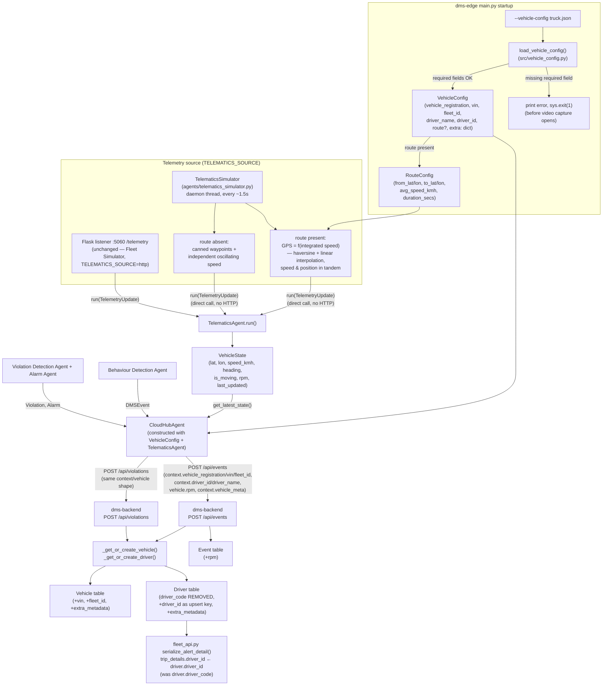

# Design — add-telematics-simulator-and-vehicle-config

## Approach

This implements the in-process "Telematics Simulator" that `.claude/skills/dms-edge-dev/SKILL.md` already anticipates but hasn't built — a `TELEMATICS_SOURCE`-toggled daemon thread that drives `TelematicsAgent.run()` directly, no HTTP hop, no second process. It does not touch the existing `TELEMATICS_SOURCE="http"` path (the Flask listener on `TELEMATICS_INGEST_PORT` keeps running unconditionally so a real Fleet Simulator can still POST to it).

**GPS and speed are kept in tandem, not independently faked.** When `--vehicle-config` supplies an optional `route` (from/to lat-lon, average speed km/h, video duration secs), the simulator derives GPS position from accumulated speed rather than generating position and speed separately — position is always the numerically-integrated consequence of the speed being reported at each tick, so the two can never be physically inconsistent (see "Telematics Simulator internals" below for the exact model). Without a `route`, the simulator falls back to the original canned-waypoint + independent-speed design — still useful for a quick demo where an exact route doesn't matter, but not in tandem.

RPM is added end-to-end, mirroring exactly how `speed_kmh` already flows: `TelemetryUpdate` → `VehicleState` → `CloudHubAgent`'s `vehicle` dict → backend `VehicleIn` schema → `Event.rpm` column.

Vehicle/driver identity moves from a single hardcoded `EDGE_VEHICLE_REGISTRATION` env var to an optional `--vehicle-config <path.json>` flag. When given, its `VehicleConfig` fields replace the static config constants for the whole process (one flag flips the whole identity source, avoiding a silently-mixed env-var/JSON state); when absent, behavior is unchanged from today. This follows the `BaseAgent`/agentic-architecture doctrine's own guidance for `CloudHubAgent` (`.claude/skills/dms-agentic-architecture/SKILL.md`) — `VehicleConfig` is plain injected configuration passed into the agent's constructor, not a sixth agent; it doesn't have a `run()` and isn't part of the drawio boxes.

**Driver identity is a replacement, not an addition.** `Driver.driver_code` (`dms-backend/app/db/models.py`) is removed outright and replaced by a single `Driver.driver_id` column (the fleet-system ID from `--vehicle-config`). Grepping the codebase confirmed `driver_code` has exactly one write site (`inject_api.py::_get_or_create_driver`) and one read site (`fleet_api.py::serialize_alert_detail`, which already mislabels it `"driver_id"` in its JSON output) — nothing else references it, so there's no reason to carry both fields. This also fixes the pre-existing mislabeling instead of compounding it with a second, genuinely-distinct `driver_id` column living alongside the unused `driver_code`.

Backend changes are additive-only nullable columns on `Vehicle`/`Driver`, consistent with this repo's existing "no Alembic, `Base.metadata.create_all` only" approach (confirmed: `dms-backend/app/db/database.py::init_db()` — no `alembic/` directory exists anywhere in the repo).

## Architecture / flow



## Files touched

**New**

| File | Purpose |
|---|---|
| `dms-edge/agents/telematics_simulator.py` | `TelematicsSimulator` class: route-interpolation model (GPS/speed tandem, when `route` is supplied) + fallback canned-waypoint/independent-speed model, RPM generator, daemon-thread loop calling `TelematicsAgent.run()` directly |
| `dms-edge/src/vehicle_config.py` | `VehicleConfig`/`RouteConfig` dataclasses + `load_vehicle_config(path) -> VehicleConfig \| None` loader/validator |
| `dms-edge/fleet/example-vehicle-config.json` | Example JSON an operator can copy for `--vehicle-config` |

**Modified — dms-edge**

| File | Change |
|---|---|
| `dms-edge/agents/telematics_agent.py` | Add `rpm: float = 0.0` to `TelemetryUpdate` (+ parse from `payload.get("rpm", 0.0)` in `from_json`); add `rpm: float \| None = None` to `VehicleState`; set `rpm=input_.rpm` in `TelematicsAgent.run()` |
| `dms-edge/agents/cloud_hub_agent.py` | Constructor takes optional `vehicle_config: VehicleConfig \| None`; `_map_event`/`_map_violation` add `"rpm": vehicle_state.rpm` to `"vehicle"` dict; `context` dict fields sourced from `vehicle_config` when present, else existing static config constants |
| `dms-edge/src/config.py` | Add `TELEMATICS_SOURCE`, `TELEMATICS_SIM_INTERVAL_SECS`, `TELEMATICS_SIM_RPM_IDLE`, `TELEMATICS_SIM_RPM_CRUISE` in the "Agentic layer" section |
| `dms-edge/main.py` | Add `--vehicle-config` CLI arg; call `load_vehicle_config()` before `cv2.VideoCapture`; start `TelematicsSimulator` thread when `TELEMATICS_SOURCE == "simulator"`; pass `vehicle_config` into `CloudHubAgent(...)` |

**Modified — dms-backend**

| File | Change |
|---|---|
| `dms-backend/app/db/models.py` | `Vehicle`: add `vin`, `fleet_id`, `extra_metadata` (JSON, nullable). `Driver`: **remove `driver_code`**, add `driver_id` (nullable, unique, indexed — the new sole upsert key) and `extra_metadata`. `Event`: add `rpm` (Float, nullable) |
| `dms-backend/app/schemas.py` | `ContextIn`: **remove `driver_code`**, add `vehicle_vin`, `vehicle_fleet_id`, `driver_id`, `vehicle_meta`, `driver_meta` (all optional). `VehicleIn`: add `rpm: float \| None = None` |
| `dms-backend/app/api/inject_api.py` | `_get_or_create_vehicle()`: set/refresh `vin`, `fleet_id`, `extra_metadata`. `_get_or_create_driver()`: upsert on `driver_id` (was `driver_code`), set `name`, `extra_metadata`. `receive_event()`: pass `payload.vehicle.rpm` into `models.Event(rpm=...)` |
| `dms-backend/app/api/fleet_api.py` | `serialize_alert_detail()`: fix `"driver_id": driver.driver_code` → `"driver_id": driver.driver_id` |

## Data / API contract changes

### `TelemetryUpdate` (dms-edge/agents/telematics_agent.py)
```python
@dataclass
class TelemetryUpdate:
    truck_id: str
    latitude: float
    longitude: float
    speed: float = 0.0
    heading: float = 0.0
    status: str = "STOPPED"
    rpm: float = 0.0                      # NEW
    timestamp: str | None = None

    @classmethod
    def from_json(cls, payload: dict) -> "TelemetryUpdate":
        return cls(
            truck_id=str(payload["truckId"]),
            latitude=float(payload["latitude"]),
            longitude=float(payload["longitude"]),
            speed=float(payload.get("speed", 0.0)),
            heading=float(payload.get("heading", 0.0)),
            status=str(payload.get("status", "STOPPED")),
            rpm=float(payload.get("rpm", 0.0)),   # NEW — default 0.0 for payloads that don't send it yet
            timestamp=payload.get("timestamp"),
        )
```

### `VehicleState` (dms-edge/agents/telematics_agent.py)
```python
@dataclass
class VehicleState:
    lat: float | None = None
    lon: float | None = None
    speed_kmh: float | None = None
    heading: float | None = None
    is_moving: bool = False
    rpm: float | None = None              # NEW
    last_updated: float | None = None
```
`TelematicsAgent.run()` adds `rpm=input_.rpm` to the `VehicleState(...)` construction.

### New `VehicleConfig` (dms-edge/src/vehicle_config.py)
```python
from __future__ import annotations
from dataclasses import dataclass, field
import json
import sys

REQUIRED_FIELDS = ("vehicle_registration", "vin", "fleet_id", "driver_name", "driver_id")

@dataclass
class RouteConfig:
    """Optional — drives the GPS/speed tandem. Absent means the simulator falls
    back to the original canned-waypoint + independent-speed behavior."""

    from_lat: float
    from_lon: float
    to_lat: float
    to_lon: float
    avg_speed_kmh: float
    duration_secs: float


@dataclass
class VehicleConfig:
    vehicle_registration: str
    vin: str
    fleet_id: str
    driver_name: str
    driver_id: str
    route: "RouteConfig | None" = None          # optional — see RouteConfig
    extra: dict = field(default_factory=dict)   # any JSON keys beyond the required 5 and "route"

    @classmethod
    def from_file(cls, path: str) -> "VehicleConfig":
        with open(path, "r", encoding="utf-8") as f:
            data = json.load(f)

        missing = [k for k in REQUIRED_FIELDS if not data.get(k)]
        if missing:
            print(f"ERROR: --vehicle-config {path} is missing required field(s): {', '.join(missing)}")
            sys.exit(1)

        route = None
        route_data = data.get("route")
        if route_data is not None:
            missing_route = [k for k in ROUTE_REQUIRED_FIELDS if route_data.get(k) is None]
            if missing_route:
                print(
                    f"ERROR: --vehicle-config {path}'s \"route\" is missing "
                    f"required field(s): {', '.join(missing_route)}"
                )
                sys.exit(1)
            route = RouteConfig(
                from_lat=float(route_data["from_lat"]),
                from_lon=float(route_data["from_lon"]),
                to_lat=float(route_data["to_lat"]),
                to_lon=float(route_data["to_lon"]),
                avg_speed_kmh=float(route_data["avg_speed_kmh"]),
                duration_secs=float(route_data["duration_secs"]),
            )

        extra = {k: v for k, v in data.items() if k not in REQUIRED_FIELDS and k != "route"}
        return cls(
            vehicle_registration=str(data["vehicle_registration"]),
            vin=str(data["vin"]),
            fleet_id=str(data["fleet_id"]),
            driver_name=str(data["driver_name"]),
            driver_id=str(data["driver_id"]),
            route=route,
            extra=extra,
        )


def load_vehicle_config(path: str | None) -> VehicleConfig | None:
    if path is None:
        return None
    try:
        return VehicleConfig.from_file(path)
    except (OSError, json.JSONDecodeError) as exc:
        print(f"ERROR: could not load --vehicle-config {path}: {exc}")
        sys.exit(1)
```
`ROUTE_REQUIRED_FIELDS = ("from_lat", "from_lon", "to_lat", "to_lon", "avg_speed_kmh", "duration_secs")` — all-or-nothing: `route` is optional as a whole block, but once present every one of its 6 fields is required (same fail-fast philosophy as the top-level required fields, and for the same reason — a half-specified route can't be interpolated).

### Example `--vehicle-config` JSON file, with route (`dms-edge/fleet/example-vehicle-config.json`)
```json
{
  "vehicle_registration": "MH-12-AB-4321",
  "vin": "1HGCM82633A004352",
  "fleet_id": "FLEET-WEST-07",
  "driver_name": "Ramesh Kulkarni",
  "driver_id": "DRV-10245",
  "depot": "Pune Hub 3",
  "insurance_expiry": "2027-01-15",
  "notes": "Demo truck for AI COE showcase",
  "route": {
    "from_lat": 18.5204,
    "from_lon": 73.8567,
    "to_lat": 19.0760,
    "to_lon": 72.8777,
    "avg_speed_kmh": 60,
    "duration_secs": 180
  }
}
```
`depot`, `insurance_expiry`, `notes` end up in `VehicleConfig.extra` and are forwarded opaquely as `context.vehicle_meta`. `route` is parsed into `RouteConfig` separately and is not part of `extra`. Omitting `route` entirely is valid — the file above is unchanged from before this addendum except for the added block.

### `CloudHubAgent` constructor and mapping (dms-edge/agents/cloud_hub_agent.py)
```python
def __init__(self, telematics_agent: TelematicsAgent, vehicle_config: "VehicleConfig | None" = None) -> None:
    self._telematics_agent = telematics_agent
    self._vehicle_config = vehicle_config

def _vehicle_registration(self) -> str:
    return self._vehicle_config.vehicle_registration if self._vehicle_config else EDGE_VEHICLE_REGISTRATION
```
`_map_event`/`_map_violation`'s `"context"` dict becomes:
```python
"context": {
    "vehicle_registration": self._vehicle_registration(),
    "vehicle_vin": self._vehicle_config.vin if self._vehicle_config else None,
    "vehicle_fleet_id": self._vehicle_config.fleet_id if self._vehicle_config else None,
    "driver_id": self._vehicle_config.driver_id if self._vehicle_config else None,
    "driver_name": self._vehicle_config.driver_name if self._vehicle_config else None,
    "vehicle_meta": (self._vehicle_config.extra or None) if self._vehicle_config else None,
    "frame_index": event.frame_index,       # _map_event only
    "camera_id": CAMERA_ID,
    "lat": vehicle_state.lat,
    "lon": vehicle_state.lon,
},
"vehicle": {
    "speed_kmh": vehicle_state.speed_kmh,
    "is_moving": vehicle_state.is_moving,
    "rpm": vehicle_state.rpm,
},
```

**JSON file coexistence with `EDGE_VEHICLE_REGISTRATION`**: `--vehicle-config`'s `vehicle_registration` replaces `EDGE_VEHICLE_REGISTRATION` for the whole process when the flag is given; the env var remains the default when no flag is given. One flag flips the whole identity source — avoids silently mixing env-var and JSON-sourced identity mid-run.

### Backend `ContextIn` schema (dms-backend/app/schemas.py)
```python
class ContextIn(BaseModel):
    vehicle_registration: str
    vehicle_vin: str | None = None            # NEW
    vehicle_fleet_id: str | None = None        # NEW
    driver_id: str | None = None                # REPLACES driver_code — fleet-system driver ID
    driver_name: str | None = None
    vehicle_meta: dict[str, Any] | None = None  # NEW — opaque passthrough
    driver_meta: dict[str, Any] | None = None    # NEW — reserved, unpopulated by this change (see Alternatives)
    trip_id: str | None = None
    route: str | None = None
    shift_label: str | None = None
    trip_started_at: float | None = None
    elapsed_trip_seconds: float | None = None
    frame_index: int | None = None
    camera_id: str | None = None
    lat: float | None = None
    lon: float | None = None
    waypoint_name: str | None = None
    distance_to_waypoint_km: float | None = None
```
`driver_code` is removed, not deprecated-in-place — it was never populated by any real code path (see design's Approach section), so there is no existing caller to keep compatible.

### Backend `VehicleIn` schema
```python
class VehicleIn(BaseModel):
    speed_kmh: float | None = None
    is_moving: bool = True
    vehicle_type: str | None = None
    region: str | None = None
    rpm: float | None = None    # NEW
```

### Backend `Vehicle` / `Driver` / `Event` models (dms-backend/app/db/models.py)
```python
class Vehicle(Base):
    __tablename__ = "vehicles"
    id = Column(Integer, primary_key=True)
    registration = Column(String, unique=True, nullable=False, index=True)
    vin = Column(String, nullable=True)                 # NEW
    fleet_id = Column(String, nullable=True)             # NEW
    vehicle_type = Column(String, default="18-wheeler box truck")
    region = Column(String, nullable=True)
    route_default = Column(String, nullable=True)
    edge_device_id = Column(String, nullable=True)
    edge_device_status = Column(String, default="Online")
    firmware_version = Column(String, default="v2.3")
    extra_metadata = Column(JSON, nullable=True)          # NEW — opaque passthrough from --vehicle-config
    last_seen_at = Column(DateTime, default=utcnow, onupdate=utcnow)

class Driver(Base):
    __tablename__ = "drivers"
    id = Column(Integer, primary_key=True)
    driver_id = Column(String, unique=True, nullable=True, index=True)   # REPLACES driver_code — fleet-system ID
    name = Column(String, nullable=True)
    extra_metadata = Column(JSON, nullable=True)              # NEW

class Event(Base):
    # ... existing columns ...
    speed_kmh = Column(Float, nullable=True)
    rpm = Column(Float, nullable=True)     # NEW
    is_moving = Column(Boolean, default=True)
```
`driver_id` is `nullable=True` (an event can still arrive with no driver identity at all, same as `driver_code` was) but `unique=True` where populated, taking over `driver_code`'s exact role as the sole upsert key — it is a rename-and-repurpose, not an additional column.

### `driver_code` → `driver_id` replacement

`Driver.driver_code` is removed. `Driver.driver_id` takes over as the single driver-identity column and upsert key, populated from `--vehicle-config`'s required `driver_id` field (the fleet-system ID) rather than the old, never-populated `driver_code` concept. `_get_or_create_driver()` upserts on `ctx.driver_id` directly — no dual-key branching needed, since there is only one key now.

### `inject_api.py` upsert logic — updated
```python
def _get_or_create_vehicle(
    db: Session, ctx: schemas.ContextIn, vehicle_in: schemas.VehicleIn
) -> models.Vehicle:
    vehicle = (
        db.query(models.Vehicle).filter(models.Vehicle.registration == ctx.vehicle_registration).first()
    )
    if vehicle is None:
        vehicle = models.Vehicle(
            registration=ctx.vehicle_registration,
            vin=ctx.vehicle_vin,
            fleet_id=ctx.vehicle_fleet_id,
            vehicle_type=vehicle_in.vehicle_type or "18-wheeler box truck",
            region=vehicle_in.region,
            route_default=ctx.route,
            extra_metadata=ctx.vehicle_meta,
        )
        db.add(vehicle)
        db.flush()
    else:
        # keep vin/fleet_id/extra_metadata fresh if a later event carries them
        # (e.g. first event arrived before --vehicle-config was wired up)
        if ctx.vehicle_vin:
            vehicle.vin = ctx.vehicle_vin
        if ctx.vehicle_fleet_id:
            vehicle.fleet_id = ctx.vehicle_fleet_id
        if ctx.vehicle_meta:
            vehicle.extra_metadata = ctx.vehicle_meta
    return vehicle


def _get_or_create_driver(db: Session, ctx: schemas.ContextIn) -> models.Driver | None:
    if not ctx.driver_id:
        return None

    driver = db.query(models.Driver).filter(models.Driver.driver_id == ctx.driver_id).first()
    if driver is None:
        driver = models.Driver(
            driver_id=ctx.driver_id,
            name=ctx.driver_name,
            extra_metadata=ctx.driver_meta,
        )
        db.add(driver)
        db.flush()
    else:
        if ctx.driver_name:
            driver.name = ctx.driver_name
        if ctx.driver_meta:
            driver.extra_metadata = ctx.driver_meta
    return driver
```

### `fleet_api.py` fix
```python
# serialize_alert_detail(), trip_details block:
"driver_id": driver.driver_id if driver else None,   # was: driver.driver_code
```
This is the one line in `fleet_api.py` this change touches — the field was already named `"driver_id"` in the API's JSON output, so no consumer-facing (dms-ui) contract change occurs, only the underlying source column changes from the old, never-populated `driver_code` to the real `driver_id`.

### Telematics Simulator internals

Two motion models, selected per-instance based on whether `VehicleConfig.route` is present:

**Fallback model (no `route` supplied)** — unchanged from the original design: a short 6-8 point canned waypoint loop a few km apart, looped indefinitely; independent sine-wave speed ~40-90 km/h (`speed = 65 + 25*sin(t / 180)`); RPM tracks speed via the idle/cruise bands. This path exists so `--vehicle-config` (or no config at all) still produces *some* motion without requiring a route.

**Route model (`route` supplied) — the GPS/speed tandem.** Speed and position are derived from one shared clock, not two independent generators:
1. At tick time `t` (seconds since `run_forever()` started), compute instantaneous speed by oscillating around `route.avg_speed_kmh` (e.g. `±20%`, same sine-wave shape as the fallback model) — this still gives visible speed variation for the demo, but see step 2 for why the *average* is what actually matters.
2. Numerically integrate distance traveled: `distance_km += (speed_kmh * dt_hours)` each tick, where `dt_hours = TELEMATICS_SIM_INTERVAL_SECS / 3600`. Because the instantaneous speed oscillates *around* `avg_speed_kmh` (not an independent random walk), cumulative `distance_km` over `duration_secs` converges to the same total distance a constant `avg_speed_kmh` would cover — i.e. the route completes on schedule regardless of the moment-to-moment oscillation.
3. Convert `distance_km` into a fraction of the total great-circle distance between `route.from_(lat,lon)` and `route.to_(lat,lon)` (haversine formula — see below), and interpolate GPS position that fraction of the way along the straight path.
4. Clamp: once `t >= duration_secs` (or the interpolation fraction reaches 1.0), hold position at `(to_lat, to_lon)` and report `speed_kmh = 0`, `status = "STOPPED"` — the route is "arrived," not looped. (Unlike the fallback model, a route has a defined end.)

This is the actual tandem: **GPS position is a function of accumulated speed, not an independent generator** — so they can never numerically contradict each other, only the plausible amount of jitter the oscillation itself introduces (identical to how a real GPS+odometer pairing would behave).

Haversine interpolation (pure Python, no new dependency):
```python
import math

EARTH_RADIUS_KM = 6371.0

def _haversine_distance_km(lat1, lon1, lat2, lon2) -> float:
    p1, p2 = math.radians(lat1), math.radians(lat2)
    dphi = math.radians(lat2 - lat1)
    dlambda = math.radians(lon2 - lon1)
    a = math.sin(dphi / 2) ** 2 + math.cos(p1) * math.cos(p2) * math.sin(dlambda / 2) ** 2
    return 2 * EARTH_RADIUS_KM * math.asin(math.sqrt(a))


def _interpolate(lat1, lon1, lat2, lon2, fraction: float) -> tuple[float, float]:
    """Straight-line (linear) interpolation — adequate for the short/medium
    demo distances this simulates; not true great-circle spherical interpolation
    (slerp), which isn't worth the complexity at this distance scale."""
    fraction = max(0.0, min(1.0, fraction))
    return (
        lat1 + (lat2 - lat1) * fraction,
        lon1 + (lon2 - lon1) * fraction,
    )
```

```python
class TelematicsSimulator:
    name = "telematics_simulator"

    def __init__(
        self, telematics_agent: TelematicsAgent, truck_id: str, route: "RouteConfig | None" = None
    ) -> None:
        self._agent = telematics_agent
        self._truck_id = truck_id
        self._route = route
        self._waypoints = [...]  # canned list — fallback model only
        self._t0 = time.time()
        self._distance_km = 0.0
        self._last_tick = self._t0
        if route is not None:
            self._total_distance_km = _haversine_distance_km(
                route.from_lat, route.from_lon, route.to_lat, route.to_lon
            )

    def _next_update(self) -> TelemetryUpdate:
        now = time.time()
        elapsed = now - self._t0
        if self._route is not None:
            return self._next_route_update(now, elapsed)
        return self._next_fallback_update(elapsed)

    def _next_route_update(self, now: float, elapsed: float) -> TelemetryUpdate:
        route = self._route
        if elapsed >= route.duration_secs:
            return TelemetryUpdate(
                truck_id=self._truck_id, latitude=route.to_lat, longitude=route.to_lon,
                speed=0.0, heading=0.0, status="STOPPED", rpm=self._rpm_for_speed(0.0, False),
            )

        dt_hours = (now - self._last_tick) / 3600.0
        self._last_tick = now
        speed = max(0.0, route.avg_speed_kmh + route.avg_speed_kmh * 0.2 * math.sin(elapsed / 60))
        self._distance_km += speed * dt_hours

        fraction = min(1.0, self._distance_km / self._total_distance_km) if self._total_distance_km > 0 else 1.0
        lat, lon = _interpolate(route.from_lat, route.from_lon, route.to_lat, route.to_lon, fraction)
        is_moving = speed > 5.0
        return TelemetryUpdate(
            truck_id=self._truck_id, latitude=lat, longitude=lon,
            speed=speed, heading=0.0,
            status="MOVING" if is_moving else "STOPPED", rpm=self._rpm_for_speed(speed, is_moving),
        )

    def _next_fallback_update(self, elapsed: float) -> TelemetryUpdate:
        idx = int(elapsed // TELEMATICS_SIM_INTERVAL_SECS)
        lat, lon = self._waypoints[idx % len(self._waypoints)]
        speed = max(0.0, 65 + 25 * math.sin(elapsed / 180))
        is_moving = speed > 5.0
        return TelemetryUpdate(
            truck_id=self._truck_id, latitude=lat, longitude=lon,
            speed=speed, heading=0.0,
            status="MOVING" if is_moving else "STOPPED", rpm=self._rpm_for_speed(speed, is_moving),
        )

    def run_forever(self) -> None:
        while True:
            self._agent.run(self._next_update())
            time.sleep(TELEMATICS_SIM_INTERVAL_SECS)
```
`truck_id` passed in is `vehicle_config.vehicle_registration if vehicle_config else EDGE_VEHICLE_REGISTRATION`; `route` is `vehicle_config.route if vehicle_config else None`.

### Threading into `main.py`
```python
vehicle_config = load_vehicle_config(args.vehicle_config)
...
telematics_agent = TelematicsAgent()
threading.Thread(target=telematics_agent.start_listener, daemon=True).start()   # unchanged — always runs

if TELEMATICS_SOURCE == "simulator":
    truck_id = vehicle_config.vehicle_registration if vehicle_config else EDGE_VEHICLE_REGISTRATION
    route = vehicle_config.route if vehicle_config else None
    simulator = TelematicsSimulator(telematics_agent, truck_id, route=route)
    threading.Thread(target=simulator.run_forever, daemon=True).start()
```
The Flask listener always starts (cheap, idle if nothing POSTs); the simulator only starts in `"simulator"` mode. This preserves `"http"` mode exactly as-is today while adding the simulator as an additional writer only in `"simulator"` mode — no `TelematicsAgent.run()` call site needs branching since it's already last-write-wins.

### Config additions (dms-edge/src/config.py)
```python
TELEMATICS_SOURCE = os.environ.get("TELEMATICS_SOURCE", "simulator")  # "simulator" | "http"
TELEMATICS_SIM_INTERVAL_SECS = float(os.environ.get("TELEMATICS_SIM_INTERVAL_SECS", "1.5"))
TELEMATICS_SIM_RPM_IDLE = (600, 900)      # idle band, rpm
TELEMATICS_SIM_RPM_CRUISE = (1200, 1900)  # cruise band, rpm — diesel truck plausible range
```

### Local `dms-edge/storage/models.py`
No change — it's explicitly single-vehicle scope (no `vehicle_id`/`driver_id` FKs) and doesn't carry `speed_kmh` either today, so RPM has no analogous local column to add.

## Alternatives considered

1. **Two separate `vehicle_meta`/`driver_meta` blobs vs. one combined `vehicle_meta` in the wire payload.** Chose one combined `context.vehicle_meta` because the JSON config file has no sub-object separating "vehicle stuff" from "driver stuff" — it's a flat key list per the locked-in required-fields list (`vehicle_registration` and `driver_name` at the same level). Splitting would require either inventing a nested `{"vehicle": {...}, "driver": {...}}` JSON shape (rejected — user's decision describes a flat file) or arbitrarily guessing which extra key belongs to which entity. The backend schema still gets both `vehicle_meta`/`driver_meta` fields for forward compatibility, but only `vehicle_meta` is populated by this change.
2. **Replace `Driver.driver_code` with `driver_id` vs. add `driver_id` as a second, parallel column.** Chose outright replacement (per explicit user follow-up instruction) over keeping both. `driver_code` was never populated by any real code path (`dms-edge` never sent it) and had exactly one write site and one read site in the whole codebase (confirmed via grep) — keeping it alongside a new `driver_id` would only preserve dead schema and the pre-existing `fleet_api.py` mislabeling (`"driver_id": driver.driver_code`) that this change is explicitly fixing. Rejected the additive option as strictly worse: more columns, same confusion, no compatibility actually gained since nothing depended on `driver_code`.
3. **Per-table `extra_metadata` columns vs. a single shared `Event.context_meta`.** Chose per-table (`Vehicle.extra_metadata`, `Driver.extra_metadata`) because `Vehicle`/`Driver` are the long-lived, deduplicated entities the metadata is actually about — attaching it to `Event` would duplicate the same blob on every event/violation row and go stale if only the most-recent event is queried. Mirrors the existing pattern where `Vehicle.vehicle_type`/`region` and `Driver.name` already live on the entity tables.
4. **Alembic migrations vs. `create_all`-only.** Confirmed no `alembic/` directory or `alembic.ini` exists anywhere in the repo — `init_db()` relies entirely on `Base.metadata.create_all(bind=engine)`, additive-only for brand-new tables/databases, no ALTER support. Introducing Alembic now is disproportionate to this POC's "quick and dirty but demoable" philosophy; documented as a risk instead, with "delete the gitignored local `dms.db`" as the accepted workaround.
5. **`dms-edge/src/vehicle_config.py` as a separate module vs. inline in `main.py`.** Chose a separate module to keep `main.py` (already handling CLI parsing, agent wiring, frame loop) from growing further, consistent with `src/` already hosting config-adjacent, non-CV-pipeline code (`src/config.py`).
6. **`route` inside `--vehicle-config` vs. separate `--route-from`/`--route-to`/`--avg-speed-kmh`/`--sim-duration-secs` CLI flags.** Chose nesting inside the existing JSON file (Option B in explore.md) to avoid growing `main.py`'s CLI surface by 4 more flags and because a route is per-demo-run configuration exactly like vehicle/driver identity — one file describes "this run: this truck, this driver, this route." Rejected separate flags as it would split one logical "this is what this run represents" concept across two input mechanisms (JSON file + CLI flags) for no benefit.
7. **Constant `avg_speed_kmh` for the whole route vs. oscillating around it.** Chose oscillation (±20%, same sine-wave shape as the fallback model) so the demo still shows visible speed variation, matching the original design's realism goal — the "avg" in `avg_speed_kmh` is honored because the oscillation is *around* that value and distance is integrated from the actual instantaneous speed, so total distance-over-duration still converges correctly (see "Telematics Simulator internals"). A flat constant speed was considered simpler but would look robotic in a demo (identical speed reading at every tick).
8. **Linear lat/lon interpolation vs. true spherical (slerp) interpolation.** Chose linear interpolation between `from`/`to` coordinates — adequate accuracy at typical demo-route distances (tens to low-hundreds of km) where the difference from true great-circle interpolation is negligible, and avoids extra trigonometry for a POC. Haversine is still used for the *total distance* calculation (which does need to be accurate for pacing), just not for intermediate-point interpolation.
9. **`duration_secs` as an explicit required route field vs. auto-detected from the video file.** `main.py` starts the Telematics Simulator thread before opening `cv2.VideoCapture(args.video)` (see "Threading into main.py"), so video duration isn't known yet at simulator-construction time without reordering startup. Explicit `duration_secs` sidesteps this and matches the user's stated requirement directly; auto-detection is a possible future refinement, not pursued here.

## Risks / open questions

1. **Existing `dms.db` files won't gain/rename columns.** `create_all` doesn't ALTER tables; a pre-existing local `dms-backend` SQLite DB still has the old `driver_code` column and lacks `vin`/`fleet_id`/`driver_id`/`extra_metadata`/`rpm` entirely — it will throw `sqlite3.OperationalError: no such column` on first insert/query referencing any of these. Mitigation: document "delete your local `dms.db` and let `init_db()` recreate it"; no in-place migration or data carry-over from `driver_code` is being built (acceptable since `driver_code` was never populated with real data — see Approach).
2. **`fleet_api.py` fix is a one-line, same-shape change.** `serialize_alert_detail()`'s JSON output already has a `"driver_id"` key (currently sourced from `driver.driver_code`); this change only repoints its source to `driver.driver_id`. No `dms-ui`-facing contract/shape change, so this is safe to include without touching the frontend.
3. **Backward compatibility with `EDGE_VEHICLE_REGISTRATION` and `run_demo.sh`.** No flag = no behavior change (gated on `vehicle_config is None`); `run_demo.sh` passes through `"$@"` already, so `--vehicle-config` works through it with no script edit required.
4. **`TELEMATICS_SOURCE="http"` + simulator both writing state.** Addressed by only starting the simulator thread in `"simulator"` mode — if a leftover Fleet-Simulator process is also POSTing to `:5060` while `"simulator"` mode is active, the two would race, with `VehicleState` reflecting whichever wrote last (same last-write-wins behavior `TelematicsAgent` already has for any two callers). Worth a one-line code comment noting this is expected, not a bug.
5. **Opaque metadata JSON-serializability.** `VehicleConfig.extra`/`extra_metadata` values originate from `json.load()`, so they're JSON-serializable by construction — no extra validation needed at load time. Very large/deeply nested blobs could bloat the SQLite `JSON` column and wire payload; not worth guarding against for a POC, but worth a one-line comment.
6. **`rpm` default `0.0` vs `None` semantics.** `TelemetryUpdate.rpm` defaults to `0.0` (matches `speed`'s existing default) but `VehicleState.rpm`/`VehicleIn.rpm` are `float | None` — a payload omitting `rpm` reports `0.0` ("engine off") rather than `None` ("unknown"). This mirrors the same pre-existing ambiguity `speed` already has, so it's consistent with current conventions, not a new problem.
7. **RPM not surfaced on the dashboard yet.** Data lands in `Event.rpm` but is inert until a follow-up UI change reads it — acceptable for this change's backend/edge-only scope, but should be called out so nobody expects to see RPM in the demo dashboard immediately after this ships.
8. **`duration_secs` mismatched against the actual video length.** Since duration is operator-supplied rather than read from the video file, if the operator gets it wrong (e.g. `--video` is actually 5 minutes but `duration_secs: 180`), the simulated truck will "arrive" at the `to` coordinate and sit at `speed_kmh = 0` for the remainder of the demo, rather than erroring — this is a silent, cosmetic mismatch, not a crash. Acceptable for a POC; worth a one-line note in the example JSON's comments/README reminding operators to match `duration_secs` to their actual `--video` file's length.
9. **Wall-clock drift vs. `TELEMATICS_SIM_INTERVAL_SECS`.** The route model's `dt_hours` is computed from actual elapsed wall-clock time between ticks (`now - self._last_tick`), not the nominal interval — this makes distance integration robust to scheduling jitter/GC pauses (a `time.sleep(1.5)` loop is not exactly 1.5s), so the tandem property holds even if ticks are irregular. No action needed, just documenting why `dt_hours` isn't computed as a constant.
10. **Great-circle distance (haversine) computed once at `RouteConfig` load vs. per-tick.** `_total_distance_km` is computed once in `TelematicsSimulator.__init__`, not recomputed every tick, since `from`/`to` are fixed for the run — avoids redundant trig calls every ~1.5s. Not a correctness risk, just a minor efficiency note for implementers.
