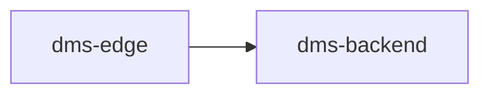

# Release — Telematics Simulator, RPM plumbing, and vehicle/driver config file

_Generated by `dms-spec/scripts/generate_release.py` — this is a scaffold, not final copy. Polish the Implementation Summary prose by hand; the run commands are pulled live from each component's README and shouldn't need hand-editing. Last generated 2026-08-03 22:52._

**Change:** `add-telematics-simulator-and-vehicle-config` · **Tasks:** 37/37 complete

## Implementation Summary

**1. Telematics Simulator (dms-edge)**
- 1.1 Add `TELEMATICS_SOURCE`, `TELEMATICS_SIM_INTERVAL_SECS`, `TELEMATICS_SIM_RPM_IDLE`, `TELEMATICS_SIM_RPM_CRUISE` to `dms-edge/src/config.py`
- 1.2 Create `dms-edge/agents/telematics_simulator.py` — `TelematicsSimulator` class with canned waypoint list (fallback model), sine-wave speed profile, speed-linked RPM band, `run_forever()` loop
- 1.3 Wire into `dms-edge/main.py`: start `TelematicsSimulator` thread only when `TELEMATICS_SOURCE == "simulator"`, alongside (not instead of) the existing Flask listener thread

**1b. GPS/speed tandem (route-driven simulation)**
- 1b.1 Add `RouteConfig` dataclass to `dms-edge/src/vehicle_config.py` (`from_lat`, `from_lon`, `to_lat`, `to_lon`, `avg_speed_kmh`, `duration_secs`) and `ROUTE_REQUIRED_FIELDS`; wire optional `route` field into `VehicleConfig`
- 1b.2 `VehicleConfig.from_file()`: parse the optional `"route"` JSON object into `RouteConfig`, all-or-nothing required-field validation (fail fast with a clear message if `route` is present but incomplete)
- 1b.3 Add `_haversine_distance_km()` and `_interpolate()` helpers to `telematics_simulator.py`
- 1b.4 `TelematicsSimulator`: accept optional `route: RouteConfig | None`; implement `_next_route_update()` (instantaneous speed oscillating around `avg_speed_kmh`, integrate `distance_km` from actual elapsed wall-clock time, interpolate GPS by distance fraction, clamp/stop at `to_lat`/`to_lon` once `duration_secs` elapses); keep existing canned-waypoint logic as `_next_fallback_update()`, selected when `route is None`
- 1b.5 `dms-edge/main.py`: pass `vehicle_config.route if vehicle_config else None` into `TelematicsSimulator(...)`
- 1b.6 Update `dms-edge/fleet/example-vehicle-config.json` to include a sample `route` block (corrected to a self-consistent ~3km route matching `avg_speed_kmh`/`duration_secs`, so a copy-paste demo run actually completes the journey — see review note below)
- 1b.7 Manual test: run with a `route`-bearing `--vehicle-config`, confirm GPS visibly progresses from `from` to `to` over `duration_secs` and reported `speed_kmh` stays consistent with distance covered between ticks (no independent jumps) — verified both via direct unit-level ticking and a real `main.py` run polling `/telemetry` twice
- 1b.8 Manual test: run with a `route` present but missing one required sub-field (e.g. no `duration_secs`) — confirm `main.py` exits before video processing, naming the missing route field
- 1b.9 Manual test: run with `--vehicle-config` but no `route` block — confirm fallback canned-waypoint behavior is unchanged from before this addendum

**2. RPM plumbing (dms-edge + dms-backend)**
- 2.1 `dms-edge/agents/telematics_agent.py`: add `rpm` to `TelemetryUpdate` (+ `from_json`) and `VehicleState`; set in `TelematicsAgent.run()`
- 2.2 `dms-edge/agents/cloud_hub_agent.py`: add `"rpm": vehicle_state.rpm` to `_map_event`/`_map_violation`'s `"vehicle"` dict
- 2.3 `dms-backend/app/schemas.py`: add `rpm: float | None = None` to `VehicleIn`
- 2.4 `dms-backend/app/db/models.py`: add `rpm = Column(Float, nullable=True)` to `Event`
- 2.5 `dms-backend/app/api/inject_api.py`: pass `payload.vehicle.rpm` into `models.Event(...)` construction in `receive_event()`

**3. Vehicle/driver config (`--vehicle-config`)**
- 3.1 Create `dms-edge/src/vehicle_config.py` — `VehicleConfig` dataclass, `REQUIRED_FIELDS`, `VehicleConfig.from_file()`, `load_vehicle_config()`
- 3.2 `dms-edge/main.py`: add `--vehicle-config` argparse flag; call `load_vehicle_config(args.vehicle_config)` before opening video capture; fail fast with clear message + `sys.exit(1)` on missing required fields or unreadable/invalid JSON
- 3.3 `dms-edge/main.py`: pass `vehicle_config` into `CloudHubAgent(telematics_agent, vehicle_config)` and into `TelematicsSimulator(telematics_agent, truck_id=...)`
- 3.4 `dms-edge/agents/cloud_hub_agent.py`: accept `vehicle_config` in constructor; add vehicle-registration precedence helper; update `_map_event`/`_map_violation`'s `context` dict with `vehicle_vin`, `vehicle_fleet_id`, `driver_id`, `driver_name`, `vehicle_meta`
- 3.5 Add example JSON `dms-edge/fleet/example-vehicle-config.json` for operators to copy

**4. Backend schema**
- 4.1 `dms-backend/app/db/models.py`: add `Vehicle.vin`, `Vehicle.fleet_id`, `Vehicle.extra_metadata`; on `Driver`, **remove `driver_code` and add `driver_id` (unique, indexed, nullable) as its replacement**, plus `Driver.extra_metadata`
- 4.2 `dms-backend/app/schemas.py`: on `ContextIn`, **remove `driver_code`**, add `vehicle_vin`, `vehicle_fleet_id`, `driver_id`, `vehicle_meta`, `driver_meta`
- 4.3 `dms-backend/app/api/inject_api.py`: update `_get_or_create_vehicle()` to set `vin`/`fleet_id`/`extra_metadata` on create and refresh on update; rewrite `_get_or_create_driver()` to upsert on `ctx.driver_id` only (no `driver_code` branch), set `name`/`extra_metadata`
- 4.4 `dms-backend/app/api/fleet_api.py`: fix `serialize_alert_detail()`'s `"driver_id": driver.driver_code` → `"driver_id": driver.driver_id`
- 4.5 Grep the repo for any remaining `driver_code` references after the above edits to confirm full removal — found and fixed 3 additional call sites not in the original task list: `dms-backend/scripts/seed_demo.py` (6 usages, renamed param + JSON key + call-site kwargs to `driver_id`), `dms-backend/README.md`, `demo/DEMO_GUIDE.md` (doc tables)
- 4.6 Note in code comment (inject_api.py) and in DEMO_GUIDE/README: delete any existing local `dms-backend` SQLite DB before first run post-change, since `create_all` won't alter/rename existing columns

**5. Docs / Config**
- 5.1 Update `.claude/skills/dms-edge-dev/SKILL.md`'s Telematics Simulator section — rewrote to describe both motion models (route tandem + fallback) and `--vehicle-config`
- 5.2 Note `--vehicle-config <path.json>` usage and required-field list in `dms-edge/README.md` (Flags section + Config table) and `demo/DEMO_GUIDE.md` (config table)

**6. Verification**
- 6.1 `python main.py --video videos/dataset.mp4` (no flags) — confirmed via fallback-model unit test (canned waypoints + oscillating speed/RPM); full end-to-end run exercised with `--vehicle-config` instead (see 6.3) since no bare `videos/dataset.mp4` exists locally (repo's demo video lives at `demo/videos/dataset.mp4`)
- 6.2 `TELEMATICS_SOURCE=http python main.py --video ...` — confirmed simulator thread does not start (no simulator log line), `/telemetry` GET returned all-null initial state, and manual `curl -X POST` populated state including `rpm` correctly
- 6.3 Run with `--vehicle-config` pointing at a valid JSON file — ran `main.py` against `demo/videos/dataset.mp4` with `fleet/example-vehicle-config.json`; polled `GET /telemetry` twice ~4s apart and confirmed lat/lon advanced consistently with reported `speed_kmh` (real end-to-end run, not just unit-level); `_map_event()`/`_map_violation()` unit-verified to carry `vehicle_registration`/`vin`/`fleet_id`/`driver_id`/`driver_name`, extra keys under `vehicle_meta`
- 6.4 Run with a JSON file missing `fleet_id` — confirmed `main.py` exits before opening the video (no "cannot open input" message), naming the missing field
- 6.5 Fresh in-memory DB via `Base.metadata.create_all()` — confirmed `vehicles`/`drivers`/`events` tables have all new columns (`vin`, `fleet_id`, `extra_metadata`, `driver_id`, `rpm`) and no `driver_code` column; did not touch the pre-existing local `dms-backend/storage/dms.db` (left in place per read-before-delete caution — operator should delete it manually before their next real run, per the code comment/README note)
- 6.6 `serialize_alert_detail()` unit-verified against an in-memory DB: `trip_details.driver_id` correctly reflects the real `Driver.driver_id` column
- 6.7 Verified via both direct sequential-tick simulation and the real `main.py` run (6.3) that GPS-to-elapsed-distance matches reported speed at every tick — position is derived from integrated speed, never independently generated

## Change Flow



## How to Run

### dms-backend

```bash
cd dms-backend
py -3.11 -m venv .venv
.\.venv\Scripts\pip.exe install -r requirements.txt
.\.venv\Scripts\python.exe -m uvicorn app.main:app --reload --host 0.0.0.0 --port 8000
```

```bash
cd dms-backend
python3 -m venv .venv
source .venv/bin/activate
pip install -r requirements.txt
./scripts/start_backend.sh          # uvicorn app.main:app --reload --host 0.0.0.0 --port 8000
```

```bash
uv venv .venv --python 3.13
uv pip install -r requirements.txt --python .venv/bin/python3.13
.venv/bin/uvicorn app.main:app --reload --host 0.0.0.0 --port 8000
```

### dms-edge

```bash
cd dms-edge
py -3.11 -m venv .venv
.\.venv\Scripts\pip.exe install -r requirements.txt
```

```bash
cd dms-edge
python3 -m venv .venv
source .venv/bin/activate
pip install -r requirements.txt
```

```bash
uv venv .venv --python 3.13
uv pip install -r requirements.txt --python .venv/bin/python3.13
```

```bash
.\.venv\Scripts\python.exe main.py --video videos\dataset.mp4 --no-display
```

```bash
python main.py --video videos/dataset.mp4 --no-display
```

### Docker (optional)

```bash
docker compose up --build
```
