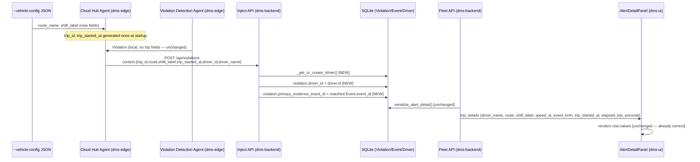

# Design — display-trip-details-in-ui

## Approach

This is a data-plumbing fix, not a new agent or a new UI surface — `dms-ui`'s `AlertDetailPanel.jsx` and `dms-backend`'s `ContextIn`/`Event`/`serialize_alert_detail` already have the exact fields needed (`driver_name`, `driver_id`, `route`, `shift_label`, `speed_at_event_kmh`, `trip_started_at`, `elapsed_trip_seconds`); every gap is upstream of that. Per `.claude/skills/dms-agentic-architecture/SKILL.md`, the Cloud Hub Agent's job is exactly "maps DMSEvent/Violation + vehicle state → backend JSON" — this change extends what it maps, it doesn't add a new agent.

Two independent problems, both fixed:

1. **Edge never generates trip context.** `VehicleConfig` (`dms-edge/src/vehicle_config.py`) carries driver/vehicle identity but no `route_name`/`shift_label`; nothing on the edge generates a `trip_id`/`trip_started_at`. Fix: add `route_name`/`shift_label` as optional static fields to `--vehicle-config` JSON (same pattern as `driver_name`/`driver_id` — loaded once, unchanging for the demo run); generate a session-scoped `trip_id` (`f"trip_{uuid4().hex[:12]}"`) and `trip_started_at` (`time.time()`) once, at `CloudHubAgent.__init__`, and reuse both for every event/violation pushed during that process's lifetime — this matches the "quick and dirty" POC bar (no real trip lifecycle/start-stop semantics needed, one demo run == one trip).

2. **Backend drops driver/event linkage on the edge-primary path.** `receive_violation` (`dms-backend/app/api/inject_api.py:154-216`, the primary ingestion path since the edge-first move) builds/updates `models.Violation` but never calls `_get_or_create_driver` or sets `violation.primary_evidence_event_id` — both of which the fallback path (`receive_event` → `violation_rules.evaluate_event`) already does correctly. Fix: call `_get_or_create_driver(db, payload.context)` and set `violation.driver_id`; resolve `primary_evidence_event_id` by looking up the most recent `Event` row matching `payload.trigger_event_ids` (falling back to the last-received event_id for that vehicle if none of the trigger IDs were separately POSTed as events — see Risks).

Once both are fixed, `ContextIn` (already declares `trip_id/route/shift_label/trip_started_at/elapsed_trip_seconds`) carries real values end-to-end, and `serialize_alert_detail`'s existing `trip_details` construction (`dms-backend/app/api/fleet_api.py:93-101`) resolves them via `violation.driver` and `_primary_event(violation)` exactly as it does today for the fallback path. No changes needed to `dms-ui` or to the API/schema contract shape.

## Architecture / flow

## Files touched

- `dms-edge/src/vehicle_config.py` — add optional `route_name: str | None`, `shift_label: str | None` to `VehicleConfig`; parse from JSON if present (no `REQUIRED_FIELDS` change — stays optional, so existing `--vehicle-config` files without them keep working and just show "—" as today).
- `dms-edge/agents/cloud_hub_agent.py` — `CloudHubAgent.__init__` generates `self._trip_id` / `self._trip_started_at` once; `_identity_context()` (or a new `_trip_context()`) adds `route`, `shift_label`, `trip_id`, `trip_started_at`, `elapsed_trip_seconds` (computed as `time.time() - self._trip_started_at` at call time) to the dict merged into both `_map_event`'s and `_map_violation`'s `context`.
- `dms-backend/app/api/inject_api.py` — `receive_violation`: call `_get_or_create_driver(db, payload.context)` and set `violation.driver_id = driver.id if driver else None`; add lookup of the matching `Event` for `primary_evidence_event_id` (see Risks for the exact matching rule).
- No changes to `dms-backend/app/schemas.py`, `dms-backend/app/db/models.py`, `dms-backend/app/api/fleet_api.py`, or any `dms-ui` file — all already correct/sufficient.

## Data / API contract changes

None. `ContextIn` (`dms-backend/app/schemas.py:14-32`) already has every field this change populates (`route`, `shift_label`, `trip_id`, `trip_started_at`, `elapsed_trip_seconds`, `driver_id`, `driver_name`). This change only starts *sending real values* for fields the contract already defined — no new fields, no breaking changes, no `dms-spec/specs/violation-detection/spec.md` requirement changes (trip-detail display isn't part of that spec's rule-evaluation scope; it may warrant its own small addition to a UI/fleet-api-facing spec at Archive time — see proposal.md's "Affected capabilities").

## Alternatives considered

See `explore.md`'s Option A (backend-only) and Option C (wall-clock-derived shift) — both covered there; user picked the full-pipeline, static-config approach (Option B) documented above.

## Risks / open questions

- **`primary_evidence_event_id` matching rule**: `payload.trigger_event_ids` (from `ViolationIn`) may reference event IDs that were never separately POSTed to `/api/events` (the edge only forwards *some* event types per `CloudHubAgent.FORWARDED_EVENT_TYPES`, and evidence frames are attached to only a subset — `EVIDENCE_EVENT_TYPES`). Resolution: look up `models.Event` by `event_id IN trigger_event_ids`, prefer the one with non-null `Evidence` (so the evidence image/video actually resolves), else the most recent by timestamp; if none of the trigger IDs match any stored `Event` at all, leave `primary_evidence_event_id` unset (matches today's silent-`None` behavior — `speed_at_event_kmh`/evidence stay "—", but driver/route/shift/trip fields — which come from `Violation`/`Driver`/`ContextIn`, not from the matched `Event` — still resolve correctly since 2 is independent of this lookup succeeding). This is a partial-degradation fallback, not a hard failure.
- **`speed_at_event_kmh` and `elapsed_trip_seconds` still come from the matched `Event`, not from `Violation`/`ContextIn` directly** (per `serialize_alert_detail`'s existing code) — so they depend on the `primary_evidence_event_id` fix landing correctly, whereas `driver_name`/`route`/`shift_label`/`trip_started_at` come from `Violation.driver` / `Vehicle.route_default` fallback / could reasonably be considered for storing directly on `Violation` too. Kept as-is (no `Violation` schema change) to keep this change minimal and consistent with how the fallback path already works — noted here in case `primary_evidence_event_id` matching proves unreliable in practice and a future change wants to store `speed_kmh`/`elapsed_trip_seconds` directly on `Violation` instead.
- **One `trip_id` per edge process lifetime** is a deliberate simplification (no ignition-cycle/trip-boundary detection) — acceptable for a demo where one run == one trip, called out explicitly so it isn't mistaken for an oversight later.
