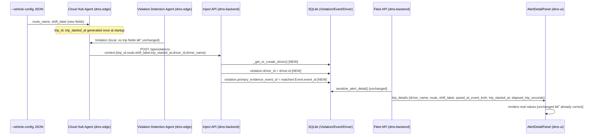

# Release — Display real trip details in the alert detail panel

_Generated by `dms-spec/scripts/generate_release.py` — this is a scaffold, not final copy. Polish the Implementation Summary prose by hand; the run commands are pulled live from each component's README and shouldn't need hand-editing. Last generated 2026-08-04 13:59._

**Change:** `display-trip-details-in-ui` · **Tasks:** 8/8 complete

## Implementation Summary

**1. dms-edge**
- 1.1 `src/vehicle_config.py`: add optional `route_name: str | None = None` and `shift_label: str | None = None` to `VehicleConfig`; parse from JSON if present (do not add to `REQUIRED_FIELDS`).
- 1.2 `agents/cloud_hub_agent.py`: generate `self._trip_id` (`f"trip_{uuid4().hex[:12]}"`) and `self._trip_started_at` (`time.time()`) once in `CloudHubAgent.__init__`.
- 1.3 `agents/cloud_hub_agent.py`: extend `_identity_context()` (or add a sibling `_trip_context()`) to include `route`, `shift_label` (from `self._vehicle_config`), `trip_id`, `trip_started_at`, and `elapsed_trip_seconds` (`time.time() - self._trip_started_at`, computed fresh per call); merge into both `_map_event`'s and `_map_violation`'s `context` dict.

**2. dms-backend**
- 2.1 `app/api/inject_api.py` `receive_violation`: call `_get_or_create_driver(db, payload.context)` and set `violation.driver_id = driver.id if driver else None`.
- 2.2 `app/api/inject_api.py` `receive_violation`: resolve `primary_evidence_event_id` by querying `models.Event` for `event_id IN payload.trigger_event_ids`, preferring one with non-null `evidence`, else most recent by `timestamp`; set `violation.primary_evidence_event_id` if found, leave unset otherwise (no error).

**3. Verification**
- 3.1 Ran the live backend against a hand-crafted `POST /api/events` + `POST /api/violations` pair shaped exactly like `CloudHubAgent`'s new payload (real `route`/`shift_label`/`trip_id`/`trip_started_at`/`elapsed_trip_seconds`/`driver_id`/`driver_name`); confirmed `GET /api/alerts/{id}` returns real values for every `trip_details` field (`driver_name: "Ramesh Kulkarni"`, `route: "Mumbai-Pune Corridor"`, `shift_label: "Day Shift (06:00-14:00)"`, `speed_at_event_kmh: 71.6`, `trip_started_at`/`elapsed_trip_seconds` populated) instead of nulls/placeholders. Test rows cleaned up afterward.
- 3.2 `VehicleConfig.from_file()` sanity-checked directly in a Python shell against the updated `dms-edge/fleet/example-vehicle-config.json` — `route_name`/`shift_label` parse correctly; both fields stay `None`-safe (optional, not in `REQUIRED_FIELDS`) for configs/runs that omit them.
- 3.3 Triggered a violation via the fallback path (`POST /api/events` for a vehicle with no `--vehicle-config` identity, no edge device) — `violation_rules.evaluate_event` still fires and creates a violation with no errors, confirming `receive_violation`'s changes (a different code path) don't affect the fallback flow. Test rows cleaned up afterward.

## Change Flow



## How to Run

### dms-backend

```bash
cd dms-backend
py -3.11 -m venv .venv
.\.venv\Scripts\pip.exe install -r requirements.txt
.\.venv\Scripts\python.exe -m uvicorn app.main:app --reload --host 0.0.0.0 --port 8000
```

```bash
cd dms-backend
python3 -m venv .venv
source .venv/bin/activate
pip install -r requirements.txt
./scripts/start_backend.sh          # uvicorn app.main:app --reload --host 0.0.0.0 --port 8000
```

```bash
uv venv .venv --python 3.13
uv pip install -r requirements.txt --python .venv/bin/python3.13
.venv/bin/uvicorn app.main:app --reload --host 0.0.0.0 --port 8000
```

### dms-edge

```bash
cd dms-edge
py -3.11 -m venv .venv
.\.venv\Scripts\pip.exe install -r requirements.txt
```

```bash
cd dms-edge
python3 -m venv .venv
source .venv/bin/activate
pip install -r requirements.txt
```

```bash
uv venv .venv --python 3.13
uv pip install -r requirements.txt --python .venv/bin/python3.13
```

```bash
.\.venv\Scripts\python.exe main.py --video videos\dataset.mp4 --no-display
```

```bash
python main.py --video videos/dataset.mp4 --no-display
```

```bash
.\.venv\Scripts\python.exe main.py --video videos\dataset.mp4 --no-display `
  --vehicle-config fleet\example-vehicle-config.json
```

```bash
{
  "vehicle_registration": "MH-12-AB-4321",
  "vin": "1HGCM82633A004352",
  "fleet_id": "FLEET-WEST-07",
  "driver_name": "Ramesh Kulkarni",
  "driver_id": "DRV-10245",
  "depot": "Pune Hub 3",
  "insurance_expiry": "2027-01-15",
  "notes": "Demo truck for AI COE showcase",
  "route": {
    "from_lat": 18.5204,
    "from_lon": 73.8567,
    "to_lat": 18.5384,
    "to_lon": 73.8757,
    "avg_speed_kmh": 60,
    "duration_secs": 180
  }
}
```

### Docker (optional)

```bash
docker compose up --build
```
