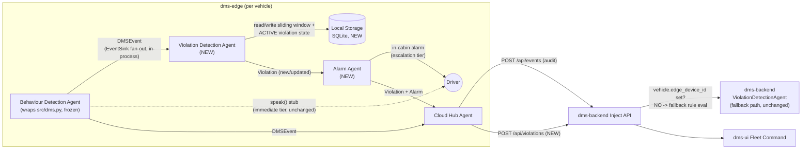

# Design — move-violation-detection-to-edge

## Approach

Port `dms-backend/app/rule_agents/violation_rules.py`'s rule logic (the exact requirements in
`dms-spec/specs/violation-detection/spec.md`: drowsiness 3-in-120s → CRITICAL, phone confidence>0.85
→ HIGH, distraction 2-in-60s → MEDIUM, continuous-drive >4h → LOW, plus the "growing violations, not
duplicates" and "simulated in-cabin response" behaviors) into a new `ViolationDetectionAgent` on
`dms-edge`, conforming to `.claude/skills/dms-agentic-architecture/SKILL.md`'s `BaseAgent` contract
(`run(event) -> Violation | None`, named after its drawio box, same as the backend version is named
today). A new `AlarmAgent` on the edge turns a triggered/updated `Violation` into an `Alarm` +
recommended-action text and fires the in-cabin alarm — a second, escalation-tier alarm distinct from
`src/dms.py`'s existing per-event `speak()` stub, which stays exactly as-is (immediate, per-event,
frozen reference code) as the first tier.

Because the rules need a rolling time window per vehicle per event type (e.g. "3 DROWSINESS events in
the last 120s") and the "growing violations" behavior needs persistent per-vehicle-per-type ACTIVE
violation state, `dms-edge` gains its own local SQLite store (`dms-edge/storage/local.db`) — the
edge equivalent of what `dms-backend/storage/dms.db` already does, same tech (SQLAlchemy + SQLite),
same "keep it simple, open source, locally runnable" convention already in force everywhere else in
this repo. A single-vehicle edge device only ever needs its own history, so this is a much smaller
schema than the backend's (no cross-vehicle fleet table needed).

`BehaviourDetectionAgent` → `ViolationDetectionAgent` integration uses the **in-process `EventSink`
extension point** that already exists in `dms-edge/main.py` (the same mechanism the file logger, SSE
sink, and `CloudHubAgent` already use) — `ViolationDetectionAgent` becomes one more sink registered
there, called synchronously on every `DMSEvent`. See `explore.md` "Options considered" for why this
beat a local HTTP loopback and a local queue/broker for a POC of this scale; the HTTP option is kept
as a documented upgrade path, not built now.

`CloudHubAgent` gains a second push alongside its existing `POST /api/events` call: whenever
`ViolationDetectionAgent` produces a new-or-updated `Violation`, `CloudHubAgent` also
`POST`s it to a new `dms-backend` endpoint, `POST /api/violations`, so the dashboard still shows it.
`dms-backend`'s own `ViolationDetectionAgent` stops evaluating rules for events from vehicles that
have an edge device (`vehicle.edge_device_id is not None`, a field `inject_api.py` already populates
today) — it remains the fallback path for the "no edge device" case the fleet-simulator design already
anticipated.

## Architecture / flow



## Files touched

**New (`dms-edge/`, future Apply — not this change):**
- `agents/violation_detection_agent.py` — `ViolationDetectionAgent`, ported rule logic
- `agents/alarm_agent.py` — `AlarmAgent`
- `storage/database.py`, `storage/models.py` — local SQLite engine + `Event`/`Violation` tables
- `storage/local.db` — gitignored, generated

**Modified (`dms-edge/`, future Apply):**
- `main.py` — register `ViolationDetectionAgent` in the `EventSink` fan-out
- `agents/cloud_hub_agent.py` — add the `POST /api/violations` push
- `src/config.py` — extend with local DB path, rule thresholds (already a pattern this file follows)

**Modified (`dms-backend/`, future Apply):**
- `app/api/inject_api.py` — new `POST /api/violations` route; `receive_event()` gates
  `violation_rules.evaluate_event()` behind `vehicle.edge_device_id is None`
- `app/schemas.py` — new `ViolationIn` (+ nested `AlarmIn`) request model

**This change (docs/skills only):**
- `.claude/skills/dms-edge-dev/SKILL.md`, `.claude/skills/dms-backend-dev/SKILL.md`,
  `.claude/skills/dms-agentic-architecture/SKILL.md`, `CLAUDE.md`,
  `dms-spec/specs/violation-detection/spec.md` (status banner only, not rewritten — see proposal.md)

## Data / API contract changes

New `dms-backend` endpoint, `POST /api/violations`, shape mirrors the existing `EventIn` nesting
style (`schemas.py`):

```python
class AlarmIn(BaseModel):
    fired_at: float
    message: str
    driver_ack_latency_seconds: float | None = None
    speed_before_kmh: float | None = None
    speed_after_kmh: float | None = None

class ViolationIn(BaseModel):
    violation_id: str
    violation_type: str          # DROWSINESS_PATTERN | PHONE_USAGE | DISTRACTION_PATTERN | CONTINUOUS_DRIVE
    severity: str                 # CRITICAL | HIGH | MEDIUM | LOW
    status: str = "ACTIVE"
    event_count: int
    trigger_event_ids: list[str]
    first_event_timestamp: float
    last_event_timestamp: float
    recommended_action_text: str
    context: ContextIn             # reuse existing shape
    vehicle: VehicleIn              # reuse existing shape
    alarm: AlarmIn
```

This does **not** change the `Event`/`Violation`/`Alarm` *storage* schema documented in
`specs/VIOLATION_AND_EVIDENCE_MODELS.md` or `dms-backend/app/db/models.py` — it's a new ingestion
route into the same tables, not a new data model. `dms-ui` needs no changes: it still reads
violations/alarms from the Fleet API exactly as today, regardless of which agent produced them.

Breaks no existing `dms-spec/specs/*/spec.md` requirement outright, but the "Server-side-only
violation detection" requirement in `violation-detection/spec.md` becomes accurate only for the
edge-less fallback path once this ships — flagged there via a status banner (see `proposal.md`) and
to be corrected for real at this change's own Archive step, once the code move actually lands.

## Alternatives considered

See `explore.md` — the event-trigger mechanism (in-process `EventSink` vs. local HTTP vs. local
queue/broker) was the one real fork; already resolved there.

## Risks / open questions

- **No independent validation of edge-computed violations.** Backend currently trusts whatever
  `POST /api/violations` sends it, same trust level it already gives `POST /api/events` today — an
  acceptable POC-scope risk, not a gap introduced by this change, but worth naming since "the edge
  decides violations now" raises the stakes slightly on that trust.
- **Rule logic duplication risk.** The edge's ported rules and the backend's fallback rules must stay
  in sync by hand — both implement the same 4 thresholds and the same `recommended_action_text`
  deterministic template. If they drift, the two code paths will look different in a
  fallback-vs-edge demo side-by-side — worth a shared-template extraction if that ever actually
  happens, not preemptively.
- **Simulated in-cabin response fields** (`driver_ack_latency_seconds`, `speed_before/after_kmh`):
  today `dms-backend` fabricates plausible values because no real device reports them. Once the edge
  is the one firing the real alarm, it's positioned to report a real `fired_at` timestamp — but
  driver acknowledgment still has no real input mechanism in this POC (no cabin button/UI), so ack
  latency likely stays simulated on the edge for now too. Not resolved here; flag for whoever does the
  Apply step.
